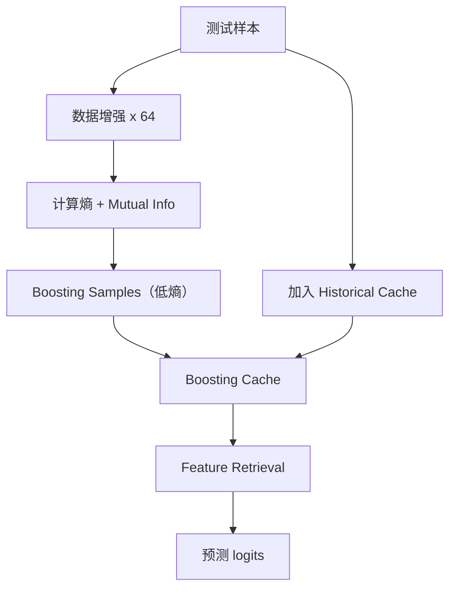
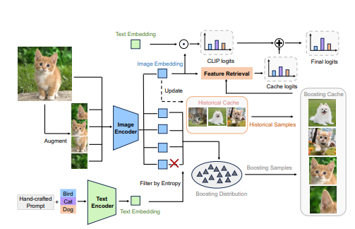

# 一、专有名词
---
## TTA、TPT、TDA
---

已有的**测试时自适应（Test-Time Adaptation, TTA）方法**分为两类：

* \*\*Training-required（需训练）\*\*方法如 TPT(Test-time Prompt Tuning)：依赖梯度下降优化，如最小化熵，但计算开销大。
* \*\*Training-free（无需训练）\*\*方法如 TDA(Test-time Distribution Alignment)：构建历史样本缓存用于特征检索，效率高，但不利用当前样本内部信息。

---
## 举例

* CoOp属于TPT
* Tip-Adapter属于TDA
---
## 伪标签 pseudo-label
---

## ✅ 澄清语义：“不是人工标签”是什么意思？

当论文中说：

> “pseudo-label 是 CLIP 的 zero-shot 预测结果，而不是人工标签”，

它的意思是：

> **这些标签不是来自人工标注数据集，而是模型基于自身的 zero-shot 能力推理出来的“预测标签”**。

也就是说：

* **人工标签（ground-truth label）**：是人为标注的数据集中的真实标签，例如 `{"image_001.jpg": "dog"}`；
* **pseudo-label**：是模型推理后预测出来的标签，例如 `argmax(CLIP_logits(x)) = "dog"`，不管对不对，作为伪标签使用；
* 虽然这个标签的名字“dog”是事先定义好的 prompt，但它**并不是该样本的人类真值标签**。

---

## ❗但你指出了一个事实：

> CLIP 的分类空间必须是预定义 prompt（如："a photo of a dog"），所以伪标签只可能是这些 prompt 中的类。

完全正确！也就是说：

> **这些 pseudo-label 虽然是“模型自己预测出来的”，但仍是从人类提供的类名集合中选出来的**。

所以准确说，它们是：

> **从人工定义好的类别集合（prompt）中，模型预测得到的类标签** —— 是一种 **“半人工的伪标签”**，但**不是 ground-truth 标签**。

---

## 🤖 举个例子具体区分：

假设我们有如下场景：

| 图像文件           | 人类真实标签（Ground Truth）     | CLIP 可用 prompt 类别集合              |
| -------------- | ------------------------ | -------------------------------- |
| image\_001.jpg | **“labrador retriever”** | \["cat", "dog", "car", "person"] |
| image\_002.jpg | **“BMW 5 series”**       | 同上                               |

我们看到：

* **Ground Truth 是非常细粒度的**，比如“拉布拉多犬”；
* **CLIP 只能预测为“dog”**（它没见过更细的 prompt）；
* 所以 BoostAdapter 使用的 pseudo-label 是 `"dog"` —— 它是“从 prompt 中选出来的类名”，**但不是人工告诉它这是“dog”**。

这就是所谓的“不是人工标签”的含义：**它是模型基于自身判断选出来的**，不依赖真实标签文件。

---

## 🧠 总结：

| 类型                 | 含义                 | 是否人为标注？ | 来源       |
| ------------------ | ------------------ | ------- | -------- |
| 人工标签（ground truth） | 明确知道图像是什么          | ✅ 是     | 人工标注的数据集 |
| pseudo-label       | 模型预测出的类别（可能对，也可能错） | ❌ 否     | 模型自身预测   |
| prompt 类别集合        | 可选的标签空间            | ✅ 是     | 人类预定义类名  |

> BoostAdapter 的 pseudo-label 是从 **人工定义的 prompt 类集合中选出的、CLIP 预测结果**，**但本身不是 ground truth 标签**，因此被称为 **pseudo-label**。

---
# 二、全文总结
---
文章 **《BoostAdapter: Improving Vision-Language Test-Time Adaptation via Regional Bootstrapping》** 提出了一种**无需训练**但可整合已有**训练式自适应方法优点**的测试时自适应（TTA）方法——**BoostAdapter**。下面对文章方法部分进行详细拆解和分析。

---

## 🧠 方法核心：BoostAdapter

BoostAdapter 的设计目标是：**在不进行额外训练的前提下，提高 CLIP 在分布外数据或跨域任务中的泛化能力。**

---

## 一、TTA 背景和现有方法分类

| 类别                      | 示例                        | 优势                                | 劣势               |
| ----------------------- | ------------------------- | --------------------------------- | ---------------- |
| 🧪 Training-required 方法 | TPT, PromptAlign, DiffTPT | 利用梯度下降、熵最小化、自监督目标优化 prompt，适应目标分布 | 开销大，需要推理阶段训练     |
| 🧠 Training-free 方法     | TDA, Tip-Adapter          | 快速、无需训练，基于记忆库检索相似样本调整预测           | 缺乏对当前测试样本自身信息的挖掘 |

---

## 二、BoostAdapter 的基本框架

BoostAdapter **融合**了上面两类方法的核心思想，通过构建一个包含两类样本的缓存（cache）：

1. **Historical samples**：来自测试流中其他样本的“低熵”历史样本（instance-agnostic）
2. **Boosting samples**：当前测试样本通过数据增强（如随机裁剪）自我生成的样本（instance-aware）

最终预测依赖于：

* 检索该测试样本与缓存中样本的特征相似度
* 使用 CLIP 和缓存输出的加权融合结果作为最终预测

### 示意图总结（来自原文 Figure 3）



---

## 三、BoostAdapter 数学表达

BoostAdapter 的预测公式如下：

$$
p_{\text{boost}}(x) = A\left(g(x) \cdot G_{\text{cache}}^T\right) \cdot Y_{\text{cache}}
$$

* $g(x)$: 图像编码器提取的测试样本特征
* $G_{\text{cache}}$: 历史样本和 boosting 样本的特征集合
* $Y_{\text{cache}}$: 相应的伪标签
* $A(\cdot)$: 相似度映射函数（例如 softmax 风格的缩放函数）

---

## 四、BoostAdapter 的核心创新点

### ✅ 1. 构建 Boosting Distribution

定义如下：

$$
x̂ \sim p_b(x) \rightarrow \{x̂ = \text{Aug}(x) \land H(p(x̂)) \leq \tau\}
$$

即，对测试样本 x 做增强，挑选熵低（高置信度）的视图作为 boosting 样本。

### ✅ 2. 建立 Cross-Entropy 优化与 Cache 检索的等价关系

* 理论上证明了：在特征空间聚类良好的条件下，对 pseudo-label 样本的交叉熵优化方向，等价于构建一个 cache classifier。

---

## 五、BoostAdapter 的训练自由机制

1. **不对模型进行参数更新**
2. **不引入 learnable prompt**
3. **仅基于测试数据增强和检索计算**

保持了 Tip-Adapter 式的高效推理，但同时引入 TPT 式的 **数据挖掘机制（boosting sample selection）**。

---

## 六、理论分析

文章给出了 BoostAdapter 的泛化误差界限推导（基于 Wasserstein 距离和密度假设）：

* **Proposition 2**：使用历史样本构建 cache 可以降低经验风险。
* **Proposition 3**：加入 boosting 样本进一步降低风险，误差上界更紧。

误差界限形式如下：

$$
E(f) \leq O\left(\left(\frac{1}{k_t + k_b}\right)^{1/4} + \cdots \right)^{1+\beta}
$$

意味着 boosting 样本带来的增益是 **理论上可证的**。

---

## 七、总结

**BoostAdapter 的方法要点如下：**

| 要素         | 内容                                             |
| ---------- | ---------------------------------------------- |
| 🎯 目标      | 提升 CLIP 的测试时泛化性能                               |
| 🏗️ 核心结构   | Memory Cache = 历史样本 + Boosting 样本              |
| 🔍 检索机制    | 测试样本与 cache 样本特征相似度                            |
| 🧠 自适应能力来源 | 高置信度样本挖掘（低熵增强视图）                               |
| 💡 创新      | 将 cross-entropy 优化行为等价为 cache-based 检索，理论和实证统一 |
| 🧪 优势      | 不需梯度更新，推理快速；同时比纯 TDA 方法更能挖掘当前样本自身语义            |

---
# 二、算法流程图解析
---



---

## 🔍 图示结构总览

BoostAdapter 的核心思想是：将**历史样本**与当前测试图像的\*\*增强样本（boosting samples）**组合进一个缓存（cache）中，通过**特征检索（feature retrieval）\*\*完成最终预测，同时避免模型参数的训练。

---

## 📌 算法流程详解

### ✅ 步骤 1：原始测试图像输入（左上角）

* 输入一个测试图像（如一只猫）。
* 这个图像被送入一个图像增强模块（**Augment**），产生多个增强版本（随机裁剪、翻转等）。

---

### ✅ 步骤 2：增强样本送入图像编码器（Image Encoder）

* 所有增强图像送入 **CLIP 的图像编码器**，得到对应的图像特征 embedding。
* 与此同时，**原始图像本身**也会被编码提取特征。

---

### ✅ 步骤 3：构建 Boosting Distribution（右下角）

* 所有增强图像的特征将根据 **熵（entropy）或 mutual information** 被评估其置信度。

  * 高熵 ⇒ 模型不确定 ⇒ 被剔除 ❌
  * 低熵 ⇒ 模型较有把握 ⇒ 被保留 ✅
* 被保留下来的增强样本被称为 **Boosting Samples**，它们共同构成 **Boosting Distribution**。

---

### ✅ 步骤 4：构建 Boosting Cache

* 这些 Boosting Samples 被存入一个只对该样本有效的“**Boosting Cache**”中（右上绿色框）。
* 它们将在后续与 CLIP 的 Text Embedding 进行特征检索，用于改善当前图像的预测。

---

### ✅ 步骤 5：构建 Historical Cache（图中央橙色框）

* 同时，从历史的测试图像流中，也会收集低熵样本，作为 **Historical Samples**。
* 它们被保存在 **Historical Cache** 中，作为更广泛分布的补充知识来源。

---

### ✅ 步骤 6：文本嵌入（Text Encoder）

* 提前准备好类别（如 Bird / Cat / Dog）对应的 **hand-crafted prompts**。
* 将它们输入 **CLIP 的文本编码器**，得到 **Text Embedding（类别中心）**。

---

### ✅ 步骤 7：特征检索（Feature Retrieval）

* 当前测试图像的特征会分别：

  * 与 Text Embedding 做点积 ⇒ 得到 **CLIP logits**
  * 与 Historical + Boosting Cache 中的样本特征做点积 ⇒ 得到 **Cache logits**

---

### ✅ 步骤 8：融合预测（Final logits）

* 最终输出 = **CLIP logits** 与 **Cache logits** 的加权融合。
* 提升了模型对 **当前样本的适应能力**，同时 **不需要更新模型参数**。

---

## 💡 小结：各组件的作用一览

| 组件                | 作用                                |
| ----------------- | --------------------------------- |
| Image Encoder     | 提取测试图像（包括增强样本）的视觉特征               |
| Text Encoder      | 提取类别的语义嵌入，用于分类                    |
| Augment + Filter  | 为当前图像生成多个版本，并筛选出高置信增强视图（boosting） |
| Historical Cache  | 存储过去测试图像中的低熵样本，作为通用参考             |
| Boosting Cache    | 存储当前图像自身的增强视图，提供细粒度语义             |
| Feature Retrieval | 将图像特征与缓存进行相似度匹配，输出 logits         |
| Final Fusion      | 融合 CLIP 的原始预测与 cache-based 的辅助预测  |

---

## ✅ 算法总结（伪代码风格）

```python
for test_image in test_stream:
    # 1. 生成增强样本
    aug_images = augment(test_image, num=64)

    # 2. 编码图像特征
    features = [ImageEncoder(img) for img in aug_images]
    
    # 3. 选出 boosting 样本（低熵）
    boosting_samples = [f for f in features if entropy(f) < threshold]
    
    # 4. 更新 Boosting Cache
    boosting_cache = boosting_samples
    
    # 5. 从历史流中维护 Historical Cache（低熵样本）
    historical_cache = update_historical_cache(test_stream)

    # 6. 检索得分
    clip_logits = similarity(test_image_feat, text_embeddings)
    cache_logits = similarity(test_image_feat, boosting_cache + historical_cache)

    # 7. 输出最终预测
    final_logits = fuse(clip_logits, cache_logits)
```
---

# 三、在特征空间聚类良好的条件下，对 pseudo-label 样本的交叉熵优化方向，等价于构建一个 cache classifier。

---
这句话出自 BoostAdapter 论文的理论部分，其完整形式是：

> **命题 1（Proposition 1）**：在特征空间聚类良好的前提下（well-clustered feature space），使用冻结 encoder，对 pseudo-label 样本进行 cross-entropy 优化，其方向等价于构建一个 cache classifier，并使用这些样本进行检索分类。

---

### 一、这句话的含义详解

论文中在第 3.2 节给出了这个命题，并在附录 C 中进行了详细证明。

* **前提条件**：

  * 图像 encoder 已冻结（即 CLIP 的图像 encoder `g(x)` 不更新）；
  * 样本的特征在空间中聚类良好（例如，属于同一类别的图像聚在一起）；
  * 使用 pseudo-label（由模型自身给出的 argmax 预测）进行 cross-entropy 优化。

* **结论**：

  * 使用这些 pseudo-label 样本进行 cross-entropy 优化，其优化方向最终会使得分类器权重 `w` 收敛到特征中心；
  * 这种收敛结果与一个 **cache classifier** 类似，后者是通过计算与历史样本的特征相似度来做预测。

换句话说：

> **cross-entropy 优化作用下学到的线性分类器，相当于一个用特征均值（聚类中心）构建的缓存分类器（cache classifier）**。

---

### 二、数学解释概要

假设每一类样本的特征都聚集在中心点 `μ_i`，且 encoder 冻结不变，论文推导如下：

* 对某一类样本，其交叉熵梯度更新方向趋向于该类特征中心；
* 所有类的 classifier 权重最终将接近各自类别的 `μ_i`；
* 而 cache classifier（如 Tip-Adapter）使用的就是这些聚类中心对新样本进行相似度加权求和预测；
* 所以两者最终的预测行为趋同。

**公式层面**：

* cross-entropy 学到的权重 `w_i → μ_i`
* cache classifier: `logits = μ_i^T g(x)` （即特征中心与测试样本做相似度）

---

### 三、命题的意义

这个命题的重要意义在于：

#### 1. **桥接训练型（TPT）与训练自由型（TDA）方法**

* TPT 是训练型方法，通过 entropy minimization 对 pseudo-label 样本进行优化；
* TDA 是训练自由方法，直接用缓存特征做检索。
* 命题 1 表明：**TPT 的优化本质上等价于构建一个 cache classifier**。

> ➤ 这就解释了为什么两者在效果上相近，甚至可以结合使用。

#### 2. **为 BoostAdapter 构建提供理论基础**

BoostAdapter 的核心策略是：

* 从测试样本生成多个增强视图（augmented views）；
* 过滤出熵值较低的视图样本（高置信度）作为 boosting samples；
* 将这些 boosting samples 加入 cache，实现“自我增强”（self-bootstrapping）；
* 然后执行 feature retrieval（训练自由）推理。

根据命题 1：

> **对 boosting samples 的 entropy 优化 ≈ 用它们构建 cache classifier ≈ BoostAdapter 的实际行为**。

因此 BoostAdapter 实质上是在无需训练的情况下复现了训练型方法的优化效果。

#### 3. **启发更广泛的训练自由策略设计**

该命题表明：

* 在结构良好的特征空间中，优化 classifier 不一定非得“训练”；
* 利用已有特征和相似度即可实现等价的预测效果。

这为设计无需更新参数的测试时适应方法提供了理论支撑和设计空间。

---

### 总结

这一定理的重要性在于：

> 它建立了**训练型方法（交叉熵优化）与训练自由方法（特征检索）之间的等价关系**，并为 BoostAdapter 提出的一种“将训练型能力迁移到训练自由框架中”的方法提供了坚实的理论支撑。

这使得 BoostAdapter 能够实现 **高效、无训练、却性能优秀的测试时适应（TTA）策略**。

---

# 四、 unseen-classes问题

---
这是一个很好的问题。在 BoostAdapter 所提出的算法流程中，虽然用到了**手工 prompt**（text embedding）来筛选增强图像、构建 cache，但整个方法的核心目标依然是**测试时（test-time）无标签分类（zero-shot classification）**，即在没有**目标域真实标签**的前提下完成分类任务。

---

## ✅ 首先确认：BoostAdapter 能否用于**未知类的分类**？

答案是 **能用于未知类（zero-shot）的分类**，前提是：

> **这些“未知类”在 CLIP 训练时或推理时被提供了相应的文本类别描述（prompt）**，即 BoostAdapter 的测试类别集是 **已知名称的 unseen classes**。

这与 CLIP 的 zero-shot 设置一致，给定一组类名称（如 “dog”, “car”, “snail” 等），通过文本 encoder 将这些类名称编码为 `w_i`，再与图像特征进行对齐。

---

## 🔍 BoostAdapter 是如何对这些“未知类”图像分类的？

参考论文的图 3（Overall architecture）和第 3.3 节实现细节：

### 1. **使用 CLIP 提供的手工 prompt 获得类别中心（文本特征）**

* 使用 CLIP 文本 encoder 将每个测试类别（例如 `"a photo of a dog"`）编码为 `w_i`；
* 它们作为**目标类别中心**，用于计算图像特征 `g(x)` 与各 `w_i` 的相似度（即 CLIP 原始 logits）。

---

### 2. **对测试样本生成增强视图，过滤熵低的样本作为 boosting samples**

* 将测试图像 `x` 做随机 crop / flip，得到一系列增强图；
* 使用 CLIP+prompt 对每个增强图进行 zero-shot 分类（输出 logits）；
* 计算其 softmax entropy，选出熵较低的图（代表模型置信高）作为 boosting samples；
* 为这些增强图分配 pseudo-label（即 argmax 类别索引）；

📌 **此处的 pseudo-label 是基于 CLIP 的 zero-shot 分类预测而来的，而不是人工标签！**

---

### 3. **将 boosting samples 和历史样本放入 memory cache**

* 缓存结构是特征-标签对（feature–pseudo-label）；
* 标签来自 CLIP 的预测结果（argmax）而非 ground truth；
* 注意这里虽然形式上是 “image–label pair”，但标签是 CLIP 推理得出的、和 prompt 对齐的结果。

---

### 4. **对测试样本进行 feature retrieval 分类**

最终分类使用如下融合形式（Eq. 7）：

```
final_logits = α · CLIP_logits(x) + (1 − α) · cache_logits(x)
```

* `CLIP_logits(x)` 是原始 zero-shot 分类分数；
* `cache_logits(x)` 是当前样本与 cache 中样本的相似度加权得分；
* 最终用这个融合得分再 `argmax` 得到类别。

---

## 🔁 总结：BoostAdapter 如何实现 zero-shot 分类？

| 步骤                     | 内容                                                 |
| ---------------------- | -------------------------------------------------- |
| **1. 类别来源**            | 通过 prompt 定义，预先提供所有类别的文本描述（如 `"a photo of a dog"`） |
| **2. 图像增强与伪标签**        | 使用 CLIP 对增强图像做 zero-shot 分类并筛选高置信伪标签               |
| **3. 构建 memory cache** | 使用增强图像特征与伪标签组成键值对                                  |
| **4. 分类方式**            | 使用当前图像与 cache 的特征相似度检索并融合 CLIP 原始得分，输出最终类别         |

🔔 **关键点在于：BoostAdapter 所用的“标签”全部来自 CLIP 的 zero-shot 预测，因此它本质上是一个“训练自由的、zero-shot 兼容”的自适应方法。**

---

