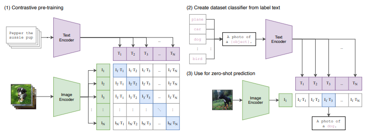

# 一、专有名词

---
## 标题理解
---
###  1. **Transferable Visual Models**

**中文：可迁移的视觉模型**

* **Visual Models（视觉模型）**：指的是用于图像或视频分析的深度学习模型，通常是卷积神经网络（CNN）或视觉 Transformer（如 ViT）。这些模型能从视觉数据中提取高层语义特征。
* **Transferable（可迁移的）**：指的是模型在一个任务上训练后，能很好地迁移到其他任务上，例如从图像分类迁移到目标检测、图像检索等。可迁移性是评估视觉模型泛化能力的重要标准。

> 本文强调的是**学习一个在多个下游任务上都能表现良好的视觉表示模型**。

---

###  2. **Natural Language Supervision**

**中文：自然语言监督**

* **Supervision（监督）**：指训练模型时提供的标签或指示信号。传统的视觉模型依赖于人工标注（如ImageNet分类标签）。
* **Natural Language（自然语言）**：指人类语言，如英语句子、描述等。这里的“监督”不再是传统的离散标签，而是**使用自然语言描述来训练模型**，例如“a photo of a cat”（一张猫的照片）。

>  该研究引入了自然语言作为图像的标签信息，通过对比学习方式训练视觉模型，这种方法大幅减少了对人工标注的依赖。

---

###  总体理解

该标题可以翻译为：

> **“利用自然语言监督学习可迁移的视觉模型”**

换句话说，这篇论文探讨了**如何使用图文配对数据（而不是传统的人工分类标签）来训练一个在多个任务中通用的视觉模型**，核心代表作就是 **CLIP（Contrastive Language–Image Pretraining）**。

---

## ✨**嵌入空间（embedding space）的概念**

---

### 1.什么是嵌入空间？

嵌入空间是指将离散或高维的输入（如图像、句子、单词）映射到一个连续、低维的向量空间中。在这个空间中，**语义相似的内容会被映射为几何上“接近”的点**。

---

### 2.为什么要用嵌入空间？

* **统一表示**：不同类型的输入（如图像和文本）可以通过各自的编码器映射到同一个空间。
* **可比较性**：在嵌入空间中，可以通过欧氏距离或余弦相似度比较两个对象是否“相似”。
* **便于下游任务**：如分类、检索、聚类、推荐等。

---

### 3.CLIP 中的嵌入空间

CLIP 中训练了两个编码器：

* **图像编码器**：把图像 $I$ 映射为向量 $\mathbf{v}_I$
* **文本编码器**：把文本 $T$ 映射为向量 $\mathbf{v}_T$

然后它们都被映射到同一个 **多模态嵌入空间**（比如一个 512 维空间）：

$$
\mathbf{v}_I, \mathbf{v}_T \in \mathbb{R}^{512}
$$

CLIP 优化的目标就是：

* 若图像和文本匹配（图文对），那么它们在这个空间中要**靠近**；
* 若不匹配，向量要**远离**。

---

### 4.嵌入空间的性质

| 性质        | 解释                                  |
| --------- | ----------------------------------- |
| **语义一致性** | 相似概念在空间中靠近（如“猫”和“狗”的图像表示接近）         |
| **跨模态对齐** | 相同语义的图像和文本距离近（如“a dog”和一张狗的照片）      |
| **方向有意义** | 某些“关系”可以表示为向量差，如：“王 - 男人 + 女人 ≈ 女王” |
| **可用于检索** | 给定一个文本，可以找最接近的图像，反之亦然               |

---

### 5.可视化示意（概念图）

```
嵌入空间（二维投影）：

        ▲ 文本：a photo of a dog
        ● 图像：狗
       (靠近)

        ▲ 文本：a photo of a cat
        ● 图像：猫
       (靠近)

        ▲ 文本：a rocket
        ● 图像：狗
       (距离远)
```

在实际应用中，这个空间是 512 维或更高维的，只能通过降维可视化（如 t-SNE 或 UMAP）。

---

### 6.现实中的嵌入空间例子

| 应用    | 嵌入空间作用                     |
| ----- | -------------------------- |
| 文本推荐  | 相似文章嵌入向量靠近                 |
| 图像检索  | 用图像或文字在嵌入空间中查找最接近的图像       |
| 多语言翻译 | 不同语言的句子映射到共享空间，语义一致性可对齐    |
| CLIP  | 文本和图像都被映射到同一空间，支持零样本分类、检索等 |

---

### 7. 总结一句话：

> 嵌入空间就是一种**将复杂信息压缩为向量表示**，并在几何上保持语义关系的空间，是多模态系统（如 CLIP）实现“跨语言/跨模态理解”的基础。

---

# 二、全文总结

---

## 核心观点

本论文提出了一种**无需特定标注任务数据即可实现图像识别与分类的新方法 CLIP（Contrastive Language–Image Pretraining）**。该方法通过对比学习，从**大规模图文对（image-text pairs）中学习通用视觉表征**，支持**零样本（zero-shot）迁移**到下游任务，具备良好的泛化能力。

---

##  方法概述

### 1. **数据构建**

* 构建了一个名为 **WIT（WebImageText）** 的图文数据集，包含 **4 亿对（image, text）**。
* 来源于公开互联网内容，筛选了语义丰富的自然语言描述。

### 2. **对比学习机制（Contrastive Pretraining）**

* 同时训练图像编码器与文本编码器。
* 学习将同一图文对映射到**相似的多模态嵌入空间**中，不同图文对的嵌入则相互远离。
* 使用 **对称交叉熵损失（symmetric cross-entropy loss）**。

### 3. **模型架构**

* 图像编码器采用 **ResNet** 或 **Vision Transformer（ViT）**。
* 文本编码器为 **Transformer**，输入为 BPE 编码的文本。
* 所有模型**从头训练（from scratch）**，不依赖 ImageNet 等已有权重。

### 4. **Zero-Shot 推理**

* 利用自然语言描述类名（如 “a photo of a cat”）作为**文本提示（prompt）**，与图像进行匹配判断其类别。
* 不需要针对具体任务的训练。

### ✨ 5.**方法总结**
* **基于一个巨大的图文对数据集，通过同时将其中图文对通过图像和文本编码器的输出映射到一个向量嵌入空间中，并通过对称交叉熵损失来实现跨模态对齐。训练完成后的模型可通过文本提示或图片提示在嵌入空间中寻找对齐的图像或文本，而不需要根据具体问题的样本重新训练。**

---

##  实验与结果

### 1. **零样本分类效果**

* CLIP 在 **ImageNet、CIFAR10、SUN397 等30+数据集**上进行评估。
* 在 **27 个数据集中的 16 个**上，**零样本 CLIP 的表现优于完全监督的 ResNet50 baseline**。
* 比如：在 STL10 数据集上，CLIP 达到 **99.3%** 准确率，为新 SOTA。

### 2. **鲁棒性分析**

* 相较传统模型，CLIP 在多种自然分布偏移下更具鲁棒性（如 ImageNet-A、ImageNet-R）。
* 在 7 个偏移测试集中，**最多提升达 75% 的“有效鲁棒性”**。

### 3. **与监督学习对比**

* CLIP 的零样本表现相当于其他模型的 few-shot（如 4-16 张样本）表现。
* 比如 BiT-M、SimCLRv2 等最佳 few-shot baseline 与 CLIP 零样本性能相当。

---

## 局限性与讨论

### 局限性：

* 零样本 CLIP 在某些复杂任务（如医学图像、卫星图像）上表现不佳。
* 相比最新监督模型，**CLIP 在整体 SOTA 上仍有差距**。
* 对 prompt 的设计敏感，不同的语言描述可能显著影响结果。
* 模型训练成本高（最高使用 592 张 V100 GPU 训练 18 天）。

### 潜在风险与社会影响：

* 模型对标签文本的敏感性可能引发偏见（如种族、性别标签设计不当）。
* 对隐私敏感的任务（如人脸识别）易被滥用。
* 模型可能对未见过的语境理解有限，存在误分类。

---

##  结论

CLIP 成功地将 NLP 中“预训练 + 下游迁移”的范式扩展到了计算机视觉。它通过从大规模图文对中学习，使模型能够通过自然语言提示实现对新任务的零样本迁移。这种通用视觉模型的训练方式代表了计算机视觉发展的一个重要方向，特别适用于**多任务、跨领域、低资源环境下的视觉推理场景**。

---

# 三、算法流程图

---



---

图中方法来自论文《CLIP: Learning Transferable Visual Models From Natural Language Supervision》，我们可以将其流程分为三个阶段，分别是：

---

## **(1) Contrastive Pre-training：对比学习预训练阶段**

这一阶段是 CLIP 的核心：

* 输入：大量从互联网收集的（图像，文本）对（例如图片和“Pepper the aussie pup”）。
* 模块：包含 **图像编码器**（如 ResNet / ViT） 和 **文本编码器**（Transformer）。
* 操作：

  * 图像经过图像编码器编码为向量 `I₁, I₂, ..., I_N`。
  * 文本经过文本编码器编码为向量 `T₁, T₂, ..., T_N`。
  * 计算图像和文本向量两两之间的**余弦相似度**：形成一个 N×N 的相似度矩阵 `Iᵢ·Tⱼ`。
  * 使用 **对比学习目标**（InfoNCE）：最大化匹配图像-文本对的相似度，同时最小化不匹配对的相似度。
  * 损失函数为 symmetric cross-entropy（对图像→文本和文本→图像方向都进行优化）。

**目的是让图像与其语义文本匹配的向量靠得更近。**

---

## **(2) Create Dataset Classifier from Label Text：构造数据集分类器**

* CLIP不需要传统的分类头，而是直接使用文本类别名称构造分类器。
* 方式：

  * 对每个类标签（如 “dog”, “car”, “bird”）构造文本描述：“A photo of a {object}.”
  * 将这些文本描述输入文本编码器，编码为特征向量 `T₁, ..., T_N`。
* 这些向量在向量空间中起到“可嵌入的类原型”作用，相当于一个可学习但固定的分类器。

---

## **(3) Zero-shot Prediction：零样本预测**

* 给定一个**新的输入图像**（可能从未见过的类别）：

  * 通过图像编码器得到图像表示向量 `Iᵢ`。
  * 与所有类别文本向量 `Tⱼ` 进行余弦相似度计算：`Iᵢ·Tⱼ`。
  * 选择相似度最高的类作为预测结果（例如 `Iᵢ·T₃` 最大 ⇒ 图像是狗）。
* **无需任何微调**，即可完成“图像 → 类别”的分类任务，称为**零样本学习**（zero-shot learning）。

---

## ✅ 小结图解逻辑

| 阶段        | 内容        | 输入      | 输出           | 关键技术          |
| --------- | --------- | ------- | ------------ | ------------- |
| (1) 预训练   | 对比学习      | 图像 & 文本 | 图像和文本的对齐嵌入空间 | 对比损失（InfoNCE） |
| (2) 分类器构建 | 文本模板生成类向量 | 类别名称    | 类别向量 `T_i`   | 自然语言嵌入        |
| (3) 预测    | 零样本分类     | 输入图像    | 类别名称         | 相似度比较         |

---

