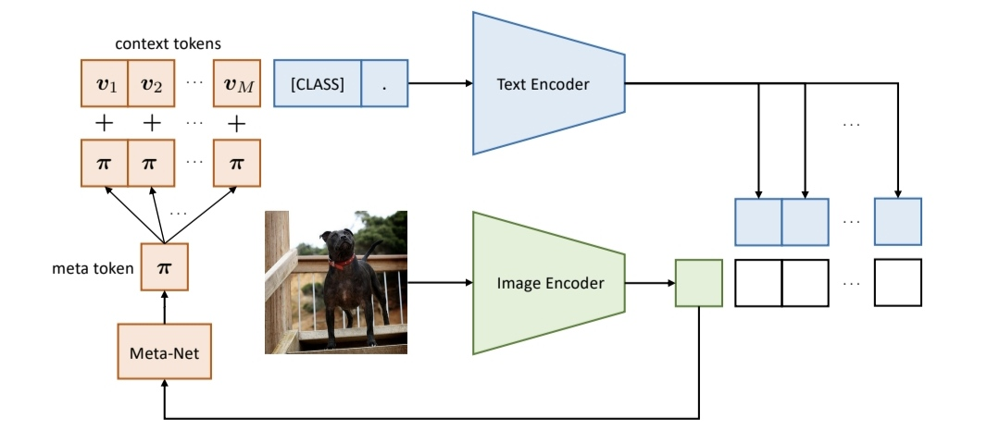

4# 一、 全文总结

---

## 🧠 CoCoOp（Conditional Prompt Learning）核心方法总结

### 🌟 核心理念：

> 将类名称 `y` 作为条件输入，利用可学习的函数 `f(y)` 动态生成每个类别专属的提示向量（prompt），从而解决 CoOp 中 **类间提示共享或过拟合的问题**。

---

### 🔧 方法结构：

#### ✅ 1. 类别嵌入：

* 使用文本编码器（如 CLIP 的 text encoder）将类名称 `y` 编码为语义嵌入 `e_y = g(y)`。

#### ✅ 2. 条件提示生成器：

* 引入一个小型的前馈神经网络（MLP）作为映射函数 `f`，根据 `e_y` 输出类别特定的上下文向量：

  $$
  V_y = f(e_y) = [v_1^y, v_2^y, ..., v_M^y]
  $$

  * 其中 `M` 是 prompt 的 token 长度，`v_i^y ∈ ℝ^d` 是每个 token 向量。

#### ✅ 3. 拼接提示：

* 构造完整文本输入为：

  $$
  p(y) = [v_1^y, v_2^y, ..., v_M^y, \text{class name}]
  $$

  * 传入 CLIP 的文本编码器，生成类别特征 `T(p(y))`。

#### ✅ 4. 匹配与训练：

* 图像通过图像编码器生成特征 `E(x)`；
* 分类通过最大化 `cos(E(x), T(p(y)))` 进行；
* 使用 cross-entropy loss 训练整个提示生成器 `f(·)`。

---

### 🚀 性能优势：

* **泛化能力强**：共享函数 `f` 生成所有类的提示，不记忆特定类参数 → 可迁移至 unseen 类；
* **鲁棒性高**：避免了 CoOp 中 class-specific prompt 的过拟合；
* **少样本/零样本下表现稳定**：在训练集和测试集类分布不一致时表现优于 CoOp。

---

## 🔍 CoCoOp 与 CoOp 方法对比

| 维度     | **CoOp**                                       | **CoCoOp**                        |
| ------ | ---------------------------------------------- | --------------------------------- |
| 提示生成方式 | 每类一个 learnable prompt 向量（可选共享或 class-specific） | 通过共享的映射函数 `f(y)`，根据类嵌入动态生成 prompt |
| 类别适应性  | 共享 prompt 时忽略类差异；class-specific 时易过拟合          | 使用条件函数可泛化到训练外的类（Unseen Classes）   |
| 泛化能力   | 训练类（Seen）表现优，但测试类（Unseen）明显下降                  | 在 Seen 和 Unseen 类别上都保持较好表现        |
| 可学习参数  | O(C × M × d)，C 为类数                             | O(M × d)，仅一个映射函数，参数更少             |
| 应用场景   | 闭集分类、固定类任务较优                                   | 零样本、跨领域任务、类不断变化任务表现更优             |
| 可解释性   | Prompt 向量可直接可视化                                | 条件函数黑盒性更强，较难解释每类 prompt 特征        |
| 消融分析结论 | class-specific prompt 性能高但泛化差                  | 适度建模类别条件，更好权衡性能与泛化性               |

---

## 🧩 图示概念类比：

| 模型     | 图示类比                          |
| ------ | ----------------------------- |
| CoOp   | 为每个类别定制一把钥匙（prompt），容易丢也不通用   |
| CoCoOp | 学习一把万能钥匙生成器（函数），能根据锁芯（类名）生成钥匙 |

---

## ✅ 总结建议：

* 如果任务是**固定类别的精细分类**（如 medical diagnosis、场景检测），**CoOp** 可能更优；
* 如果任务需要**泛化到新类、新领域**（如 zero-shot classification、多任务学习），**CoCoOp** 更适合；
* 在实际部署中，可将 CoOp 作为高性能基线，CoCoOp 作为增强泛化能力的进阶版本。
---

---
这张图是对 **CoCoOp（Conditional Prompt Learning）** 核心机制的结构化可视化，非常关键地展示了它相较于 CoOp 的**动态性**和**泛化能力来源**。下面结合图像，逐步解释其机制。

---

## 🧠 图示结构解析：CoCoOp 的条件提示学习机制

### 🔶 图像部分（下方路径）

* 输入图像通过 **CLIP 的 Image Encoder** 编码，得到图像特征向量；
* 图像特征同时被送入一个称为 **Meta-Net（元网络）** 的小网络；
* **Meta-Net 输出一个 meta token：π（pi）**，这是 CoCoOp 的关键创新。

---

### 🔷 文本部分（上方路径）

#### 💡 类别提示结构

* 文本 prompt 由两部分组成：

  1. 一组**context tokens**：可学习的向量 `[v₁, v₂, ..., v_M]`；
  2. 一个**类别 token** `[CLASS]`：即类别名称如 “dog”。

#### 🔁 Meta token π 的注入

* 每个 context token 加上 Meta token π：

  $$
  v_i' = v_i + π
  $$

  意味着所有 prompt token 在基础上都被调整为当前图像相关的上下文。

#### 🧠 文本编码器处理：

* 最终的文本输入是：

  $$
  [v_1 + π, v_2 + π, ..., v_M + π, \text{CLASS}]
  $$

  → 输入 Text Encoder → 得到图像对应类别的文本特征。

---

## 🎯 核心思想解读

| 概念               | 说明                                                         |
| ---------------- | ---------------------------------------------------------- |
| **Meta token π** | 用于根据图像生成一个软条件向量，使文本提示具备**图像条件化能力**                         |
| **Meta-Net**     | 一个小型 MLP，输入图像特征，输出 π，作为 prompt 的调整因子                       |
| **对比 CoOp**      | CoOp 的 prompt 是静态的，对所有图像都一样；CoCoOp 的 prompt 是**图像相关的动态提示** |
| **泛化能力来源**       | π 是从图像特征生成的，即使类是 unseen，也能借助图像引导 prompt 生成，使其泛化能力增强        |

---

## 📈 CoCoOp 相比 CoOp 的优势

| 方面                | CoOp                | CoCoOp                    |
| ----------------- | ------------------- | ------------------------- |
| Prompt 类型         | 固定 prompt 向量（每类或共享） | 动态 prompt（每个图像输入生成不同 π）   |
| 类别适应性             | 提示与图像无关             | 提示与图像强相关                  |
| 泛化能力              | 仅训练类有效              | 可以 generalize 到 unseen 类别 |
| 是否使用图像信息生成 prompt | ❌                   | ✅（Meta-Net）               |
| 是否适合 zero-shot    | 较弱                  | 强（图像驱动提示可适应新类别）           |

---

## ✅ 总结

> 图中展示了 CoCoOp 的最大特点：“**以图像为条件动态调整 prompt**”，用 Meta-Net 生成 meta token π，将图像语义注入到文本提示中，从而形成 **图像感知、类名称约束、结构共享** 的强泛化提示机制。
# 二、 训练方法
---
很棒的问题！我们现在详细解释 **CoCoOp** 中的核心模块——**Meta-Net（元网络）**：

---

## 🧠 1.Meta-Net 是什么？

在 CoCoOp 中，Meta-Net 是一个**条件提示调整器**，它的目标是：

> 为每一张图像 `x` 生成一个 **meta token `π(x)`**，作为 prompt 的图像条件化因子，使文本 prompt 能根据当前图像做出更好的预测。

### 结构：

Meta-Net 是一个 **小型前馈神经网络**，结构如下：

$$
\pi(x) = \text{MetaNet}(E(x))
$$

* `E(x)` 是图像 `x` 的 CLIP 图像编码器输出；
* 输出 `π(x)` 是一个向量，与 prompt 中每个 context token 相加：

$$
v_i^y \leftarrow v_i^y + \pi(x)
$$

---

## ⚙️ 2.Meta-Net 是如何训练的？

### ✅ 训练方式：

> **与整个 CoCoOp 模型一起端到端训练**，唯一可训练参数是 Meta-Net 和 context tokens（初始为随机或预设的向量）。

具体流程如下：

1. 给定训练图像 `x`，用 CLIP 图像编码器得到 `E(x)`；
2. 输入 `E(x)` 到 Meta-Net，输出 `π(x)`；
3. 将 `π(x)` 注入到 context tokens 上，构成：

   $$
   [v_1 + π(x), v_2 + π(x), ..., v_M + π(x), \text{class name}]
   $$
4. 输入 CLIP 的文本编码器，得到文本向量 `T(x, y)`；
5. 计算图像与文本的相似度：

   $$
   \text{sim}(E(x), T(x, y))
   $$
6. 用 cross-entropy loss 优化 Meta-Net 和 context tokens。

> ✅ CLIP 的图像编码器和文本编码器 **保持冻结（frozen）**，避免破坏预训练的语义对齐。

---

## 🔍 3.为什么 Meta token `π(x)` 是有效的？

### 🌟 核心动机：

CoOp 使用的是“静态提示”（对所有图像共享一组 context tokens）：

* ❌ 忽略了图像的多样性；
* ❌ 同一个 prompt 对于不同图像可能不合适（如“a photo of a bird”对各种鸟的适应性不同）；
* ❌ 泛化能力有限（尤其是 unseen 类别）。

### ✅ CoCoOp 改进点：

Meta token `π(x)` 是根据当前图像自适应生成的：

| 模块           | 静态 prompt（CoOp） | 动态 prompt（CoCoOp） |
| ------------ | --------------- | ----------------- |
| 是否感知图像       | ❌ 无             | ✅ 有，π(x) 根据图像生成   |
| 是否类别特定       | ✅ 是             | ✅ 是（与类别名拼接）       |
| 是否图像特定       | ❌ 否             | ✅ 是               |
| 泛化到 unseen 类 | 差               | 强                 |

### 🧠 本质上：

Meta token 相当于一个**图像驱动的偏移项（residual bias）**，让原始文本 prompt 能对图像语义做微调，从而提升类匹配精度。

---

## ✨ 效果验证（论文实验）

* 在 ImageNet-R、ImageNet-A、ObjectNet 等分布外测试集上，**CoCoOp 显著优于 CoOp**；
* 表明 Meta token 能捕捉图像语义、提高泛化能力。

---

## ✅ 总结

| 问题                | 回答                                                                    |
| ----------------- | --------------------------------------------------------------------- |
| **Meta-Net 是什么？** | 一个小 MLP，用图像特征生成 meta token `π(x)`，作为 prompt 的条件调整因子                   |
| **它怎么训练？**        | 与 prompt tokens 一起，端到端用 cross-entropy loss 优化，仅调 prompt 与 Meta-Net 参数 |
| **为什么有效？**        | 它使文本提示具备图像语义感知能力，提升在 unseen 类别上的泛化性能                                  |

