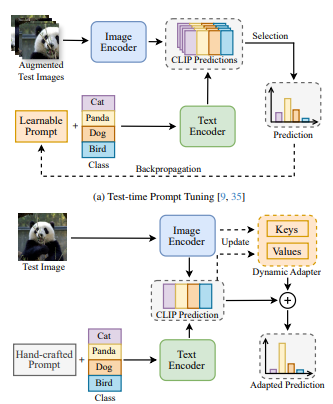

# 一、全文总结
---
这篇论文《Efficient Test-Time Adaptation of Vision-Language Models》提出了**TDA（Training-free Dynamic Adapter）**，一种用于视觉语言模型（如 CLIP）的高效\*\*测试时自适应（Test-Time Adaptation, TTA）\*\*方法。以下是全文的详细总结和方法解析：

---

## 🌟 总体贡献概览

1. **提出 TDA：** 一种训练自由（training-free）、无需反向传播的动态缓存方法，用于高效地在测试时适配视觉-语言模型。
2. **引入负伪标签（Negative Pseudo Labeling）：** 通过判断模型不属于某类，来缓解噪声伪标签的干扰。
3. **显著效率提升：** 相较于现有方法 TPT 和 DiffTPT，**TDA 在准确率更高的同时，推理时间从十几小时降至十几分钟**。

---

## 🧠 方法解析

### 1. 背景与挑战

* CLIP 能够在共享视觉-文本嵌入空间中进行零样本分类。
* 但在测试集分布发生偏移（distribution shift）时，CLIP性能显著下降。
* **TPT / DiffTPT：** 通过训练 prompt 进行适配，但计算量大、时间长，实用性差。

---

### 2. 核心思想：TDA

TDA 利用两个**非参数化缓存（key-value caches）**：

* **Positive Cache：** 存储高置信度的伪标签，表示“可能属于哪些类”。
* **Negative Cache：** 存储中等不确定性样本的负伪标签，表示“可能不属于哪些类”。

两者配合提供双向信息，提升预测准确性。

---

### 3. 模型流程详解

#### 📌 3.1 Positive Cache 构建

* 对于每个测试样本 `x_test`，CLIP 生成图像特征 `f_test`。
* 根据 `f_test·W^T` 得到类概率，生成伪标签 `l̂`。
* 条件判断：

  1. 若该类缓存尚未满，加入该伪标签。
  2. 若已满，则替换掉该类中熵值最高的旧伪标签（高熵代表预测不确定性大）。

**预测计算方式：**

```math
P_{pos}(f_{test}) = A(f_{test} Q_p^T) L̂_p
```

其中 `A` 是适配函数（exp-based soft matching）。

---

#### 📌 3.2 Negative Cache 构建

* 针对预测熵处于 \[τ\_l, τ\_h] 的中等不确定样本，生成负伪标签：

```math
L̂_n = -1_{[p < pl]}
```

表示“预测概率低于阈值 pl 的类应被排除”。

**预测计算方式：**

```math
P_{neg}(f_{test}) = -A(f_{test} Q_n^T) L̂_n
```

---

#### 📌 3.3 最终预测

将三部分线性组合：

```math
P_{TDA}(f_{test}) = f_{test} W^T + P_{pos}(f_{test}) + P_{neg}(f_{test})
```

---

### 4. 与 TPT / Tip-Adapter 对比

| 方面   | TPT    | Tip-Adapter    | TDA            |
| ---- | ------ | -------------- | -------------- |
| 训练过程 | 需要反向传播 | 不需要            | 不需要            |
| 缓存   | 无      | 静态 Few-shot 缓存 | 动态伪标签缓存（正 + 负） |
| 新类支持 | 支持     | 不支持            | 支持             |
| 计算开销 | 高      | 中等             | 低              |

---

## 📊 实验结果

### 1. 效率与准确性（ImageNet）

| 方法            | 准确率        | 测试时间         |
| ------------- | ---------- | ------------ |
| CLIP-ResNet50 | 59.81%     | 12 min       |
| TPT           | 60.74%     | 12h 50min    |
| DiffTPT       | 60.80%     | 34h 45min    |
| **TDA**       | **61.35%** | **16 min** ✅ |

---

### 2. OOD Benchmark（ImageNet-A/V2/R/S）

* 平均提升：TDA 相比 TPT 提升 +2.74%（ResNet50），+3.08%（ViT-B/16）

---

### 3. Cross-Domain Benchmark（10 个不同领域数据集）

* 平均准确率：

  * CLIP-ResNet50: 56.63%
  * TPT: 57.66%
  * DiffTPT: 59.85%
  * **TDA: 61.03%** ✅
  * CLIP-ViT-B/16: 64.59%
  * TDA (ViT): **67.53%** ✅

---

## 🔬 消融实验（Ablation Studies）

### 1. 正/负缓存的作用

* Positive cache 单独使用：60.82%
* Negative cache 单独使用：60.83%
* 二者结合（TDA）：**61.35%**

### 2. Shot capacity 参数影响

* 正缓存最佳容量为 3，负缓存为 2，容量过大会引入噪声，导致性能下降。

---

## ✅ 总结与创新点

* **无需训练、无需反向传播**，适配过程仅需前向传播和缓存更新。
* **动态双缓存机制**（正 + 负伪标签）提升适配鲁棒性。
* **效率提升巨大**，大幅缩短推理时间，同时准确率优于 SOTA。
* 可部署性强，适用于实际分布偏移环境中的 CLIP 适配。

---
# 二、算法流程图解析
---

---
这张图展示了两种测试时自适应（Test-Time Adaptation, TTA）方法的关键对比：

---

## 🔹(a) Test-time Prompt Tuning（TPT / DiffTPT）【上半部分】

### 流程步骤：

1. **输入：**
   多个增强版本的测试图像（Augmented Test Images）。

2. **图像编码器（Image Encoder）：**
   将增强后的图像输入 CLIP 的图像编码器，生成图像特征。

3. **文本编码器（Text Encoder）：**
   搭配一个**可学习的 Prompt（Learnable Prompt）**，将类别名称（如 Cat、Panda、Dog、Bird）编码为文本特征。

4. **CLIP 预测：**
   图像特征与文本特征计算相似度，产生每张图像的分类概率分布（CLIP Predictions）。

5. **选择（Selection）：**
   选出最“自信”的预测（低熵预测），作为该图像的最终伪标签。

6. **反向传播：**
   通过比较增强图像的预测结果之间的一致性，**优化 prompt（即对 prompt 参数进行反向传播）**，提高适配性。

### 特点总结：

* 每个测试样本都需优化一个 prompt，代价高。
* 强依赖**多重增强 + prompt 训练**。
* 需要 GPU 反向传播支持，**计算量大**，测试时间长达数小时。

---

## 🔹(b) Training-free Dynamic Adapter (TDA)【下半部分】

### 流程步骤：

1. **输入：**
   单张测试图像（无需增强）。

2. **图像编码器（Image Encoder）：**
   提取图像特征向量。

3. **文本编码器（Text Encoder）：**
   使用\*\*手工构造的 prompt（Hand-crafted Prompt）\*\*和类别名称生成文本特征。

4. **CLIP 预测：**
   图像特征与文本特征点积得到初始类别概率（CLIP Prediction）。

5. **动态缓存器（Dynamic Adapter）：**

   * 利用当前图像特征（key）和伪标签（value）**更新缓存**。
   * 维护两个缓存结构（图中简化为一个）：

     * **正缓存（Positive Cache）：** 存高置信度伪标签。
     * **负缓存（Negative Cache）：** 存中等不确定伪标签的“反向类别”（即模型不属于某类的暗示）。

6. **最终预测（Adapted Prediction）：**

   * 将 CLIP 原始预测 + 正缓存 + 负缓存 综合得到更鲁棒的预测结果。

### 特点总结：

* **无需训练 / 无需反向传播**。
* 每个样本只需一次前向推理 + 缓存更新。
* 推理极快，适合真实场景中的流式处理或边缘部署。

---

## 🔄 图中关键区别总结：

| 对比项       | Test-time Prompt Tuning | TDA        |
| --------- | ----------------------- | ---------- |
| Prompt 类型 | 可学习，需要训练                | 固定手工构造     |
| 是否需反向传播   | ✅ 是                     | ❌ 否        |
| 是否增强样本    | ✅ 多视图增强                 | ❌ 无需增强     |
| 伪标签机制     | 通过优化获得                  | 直接基于低熵选择   |
| 是否使用缓存    | ❌ 否                     | ✅ 是（正负双缓存） |
| 推理时间      | 数小时                     | 约 16 分钟    |
| 部署难度      | 高                       | 低，轻量级      |

---
