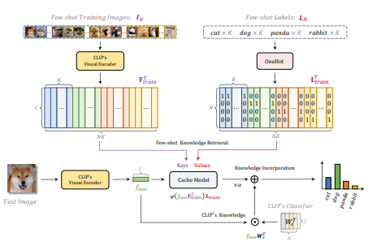

# 一、全文总结
---

## 🌟 论文核心总结

### 背景与动机

CLIP 模型在零样本分类中展现了强大的泛化能力，但在少样本设置下表现仍可提升。现有如 CoOp、CLIP-Adapter 等方法通过引入可训练模块来增强 CLIP，但需要显著训练开销。

**问题提出**：是否可以在不训练的前提下提升 CLIP 在 few-shot 任务中的表现？

---

## 💡 方法：Tip-Adapter 及 Tip-Adapter-F

### ✅ Tip-Adapter（训练无关）

1. **构建 Cache 模型（非参数化）**：

   * 使用 CLIP 的视觉编码器提取 few-shot 图像特征作为 keys。
   * 将图像标签转为 one-hot 作为 values。
   * 得到 key-value cache（特征检索数据库）。

2. **推理阶段**：

   * 输入测试图像，通过 CLIP 获取其视觉特征 `f_test`。
   * 计算与 cache 中 keys 的余弦相似度，并经 softmax 变换得到权重：

     $$
     A = \exp(-\beta(1 - f_{test} \cdot F_{train}^\top))
     $$
   * 使用这些权重加权求和 values，得到 cache 模型的预测：

     $$
     logits_{adapter} = A \cdot L_{train}
     $$
   * 与 CLIP 的原始预测 `f_test W_c^T` 加权融合（残差连接）：

     $$
     logits = \alpha \cdot logits_{adapter} + f_{test} W_c^T
     $$
   * 参数 α 控制融合权重，β 控制相似度敏感度。

### ✅ Tip-Adapter-F（带快速微调）

* 在 Tip-Adapter 基础上，**仅将 keys（F\_train）设为可学习参数**，使用 SGD 优化。
* values（L\_train）保持 frozen，不破坏 ground-truth 语义结构。
* 训练非常高效，仅需 20 个 epoch 即可超过 CoOp 和 CLIP-Adapter（200 个 epoch）。

---

## 📊 主要实验结果

| 模型             | 训练需求      | ImageNet (16-shot) | 增益 (vs. Zero-shot) | 推理延迟     | 显存      |
| -------------- | --------- | ------------------ | ------------------ | -------- | ------- |
| Zero-shot CLIP | 无         | 60.33%             | 0                  | 10.22ms  | 2227MiB |
| Tip-Adapter    | 无         | 62.03%             | +1.70%             | 10.42ms  | 2227MiB |
| Tip-Adapter-F  | 20 epoch  | 65.51%             | +5.18%             | 10.53ms  | 2227MiB |
| CLIP-Adapter   | 200 epoch | 63.59%             | +3.26%             | 10.59ms  | 2227MiB |
| CoOp           | 200 epoch | 62.95%             | +2.62%             | 299.64ms | 7193MiB |

---

## 🔍 与其他方法的关系与对比

### 与 CLIP-Adapter 的对比

* **CLIP-Adapter** 通过添加可训练的 MLP 层来适配 CLIP。
* **Tip-Adapter** 使用非参数化的缓存检索方式，不引入新的训练参数。
* 若从公式角度对比，两者的 logits 结构形式相似，Tip-Adapter 可以视为一种训练-free 的 Adapter 特例。

### 与 cache-based 网络的对比

* 传统如 MatchingNet、ProtoNet 仅使用视觉 cache。
* **Tip-Adapter 是一种视觉 + 文本的多模态 cache 模型**，引入了 CLIP 文本编码器生成的类别表示 W\_c，增强了泛化能力。

---

## 🧪 消融实验结论

* **残差权重 α**：α=1 时效果最好，说明 cache 和 CLIP 原始知识应等权融合。
* **缓存大小**：缓存越大效果越好，但也可以通过分组聚类生成少量代表性 prototype 减少 cache 尺寸。
* **微调模块选择**：只微调 keys 效果最好，微调 values 反而会导致性能下降甚至崩溃。
* **可扩展性**：在多种数据集（11个）和多种 backbone 下均取得强性能。

---

## ✅ 总结终点：Tip-Adapter 方法优势

| 特性   | Tip-Adapter | Tip-Adapter-F |
| ---- | ----------- | ------------- |
| 训练需求 | 无           | 极低（20 epoch）  |
| 引入参数 | 否           | 仅优化缓存 keys    |
| 效率   | 高           | 高             |
| 表现   | 接近有监督方法     | 超越 SoTA       |
| 泛化能力 | 强（支持OOD）    | 更强            |

---

# 二、 核心算法流程解析

---

---

这张图展示的是 **Tip-Adapter 的核心流程图**，即如何在**不训练的前提下适配 CLIP 进行 few-shot 图像分类**。下面我会按照流程顺序对图中的每一部分进行详细解释：

---

## 🧩 图中结构分区说明

整个图可以分为三个主要阶段：

1. **缓存模型构建阶段（Cache Construction）**
2. **测试图像处理与特征检索阶段（Few-shot Knowledge Retrieval）**
3. **知识融合与分类输出阶段（Knowledge Incorporation & Inference）**

---

### ① 构建 Cache 模型（左上和右上）

#### 🔸 Few-shot Training Images $I_K$

* 图像样本来自少样本训练集，例如每个类别 $K=16$ 张图，共有 $N=4$ 类（cat、dog、panda、rabbit）。
* 每张图像通过 **CLIP 的视觉编码器（Visual Encoder）** 提取特征。

#### 🔸 $F_{\text{train}} \in \mathbb{R}^{NK \times C}$

* 表示所有 few-shot 图像的特征，作为 Cache 模型中的 **Keys**。
* 每个向量是 CLIP 编码后归一化的视觉表示（L2 normalization）。

#### 🔸 Few-shot Labels $L_N$

* 每张训练图像有对应类别标签（如 cat、dog...），转换成 **One-Hot 编码**。

#### 🔸 $L_{\text{train}} \in \mathbb{R}^{NK \times N}$

* 表示所有样本的 one-hot 标签，作为 Cache 模型中的 **Values**。

---

### ② 测试图像推理与知识检索（左下 → 中间）

#### 🔸 测试图像

* 输入新的测试图像，通过 **CLIP 的视觉编码器** 提取特征 $f_{\text{test}} \in \mathbb{R}^{1 \times C}$。

#### 🔸 特征检索（与缓存计算相似度）：

* 与所有缓存 keys $F_{\text{train}}$ 做余弦相似度（向量已归一化），再用指数变换增强对比度：

  $$
  \phi(f_{\text{test}} F_{\text{train}}^\top) = \exp(-\beta(1 - \cos(f_{\text{test}}, F_{\text{train}})))
  $$
* 得到权重矩阵 $A \in \mathbb{R}^{1 \times NK}$，表示与所有训练图像的相似度。

#### 🔸 Few-shot Knowledge Retrieval：

* 利用相似度对 values $L_{\text{train}}$ 加权求和，获得分类预测：

  $$
  A \cdot L_{\text{train}} \in \mathbb{R}^{1 \times N}
  $$

  表示来自 few-shot 样本的 **软标签预测结果**。

---

### ③ 知识融合与分类输出（右下）

#### 🔸 CLIP 原始知识预测：

* 将测试特征 $f_{\text{test}}$ 与 CLIP 的文本分类器权重 $W_c \in \mathbb{R}^{N \times C}$ 相乘，得到原始 zero-shot logits：

  $$
  f_{\text{test}} W_c^\top
  $$

#### 🔸 融合最终输出 logits：

* 将两种知识通过加权残差连接方式融合：

  $$
  \text{logits} = \alpha \cdot (A \cdot L_{\text{train}}) + f_{\text{test}} W_c^\top
  $$
* 参数 $\alpha$ 控制 cache-based few-shot 信息与 CLIP zero-shot 知识之间的融合强度。

#### 🔸 最终分类结果

* 通过 softmax 得到最终类别概率。
* 条形图表示不同方法对该测试图像的分类输出比较：Zero-shot CLIP、CLIP-Adapter、Tip-Adapter，显示 Tip-Adapter 得分最高，分类最准确。

---

## 🧠 核心优势体现

* ✅ **无需训练**：只需前向提特征和构建 cache。
* ✅ **融合双重知识**：few-shot 样本（cache） + CLIP 预训练知识（文本描述）。
* ✅ **结构轻量，推理快速**：两次矩阵乘法即可完成推理。

