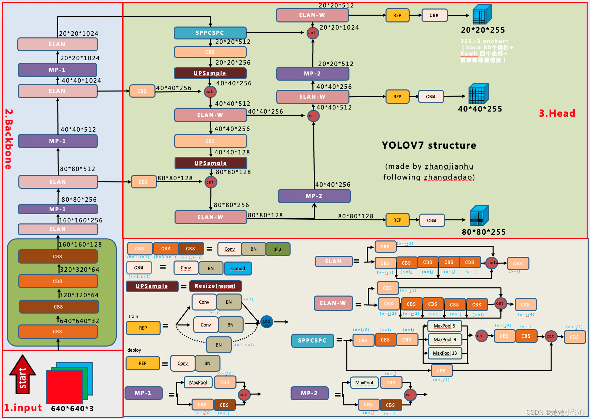

# YOLOv7结构

## 一、 YOLOv7结构图



---

## 二、 YOLOv7 全流程解析（从 Input 到 Output）

---

### 🔴 Step 1：输入图像（Input）
- 输入尺寸通常为 **640×640×3**（宽×高×通道）
  - `3` 表示 RGB 三通道
  - 会被 **归一化（normalization）**，通常像素值除以 255，变成 0~1 范围

---

### 🟦 Step 2：Backbone 主干网络（特征提取）
这是模型的“眼睛”，负责从图像中提取有意义的纹理、边缘、轮廓等特征。

### 关键模块：
- **CBS（Conv + BN + SiLU）**：基本卷积单元，组合高效
- **ELAN 模块**：深层卷积结构，保留多尺度信息
- **MP-1（MaxPool 模块）**：下采样，减小尺寸、增强感受野

#### 输出特征图尺寸变化：
| 层级 | 特征图大小 | 通道数 | 说明 |
|------|------------|--------|------|
| 输入 | 640×640    | 3      | 原图 |
| ↓ CBS×4 | 320×320 | 64     | 初步特征 |
| ↓ ELAN + MP | 160×160 | 128 | 更深特征 |
| ↓ ELAN + MP | 80×80  | 256   | 中层语义 |
| ↓ ELAN + MP | 40×40  | 512   | 更深层语义 |
| ↓ ELAN + MP | 20×20  | 1024  | 最深层语义（语义最强但空间最小）|

✅ **作用**：把图像变成语义特征图，模型“看见”了图中的物体、边缘、位置等信息。

---

### 🟩 Step 3：Neck（特征融合）
Neck 就像神经网络的大脑中枢，**融合不同层级的信息**，增强检测效果。

#### 核心模块：
- **SPPCSPC**：池化多尺度信息 → 增强感受野（类似 SPP）
- **ELAN-W**：轻量版特征融合结构
- **Upsample + cat**：上采样 + 拼接，结合不同分辨率特征图
- **MP-2**：多尺度池化加强结构，提升检测精度

#### 输出特征图：
最终融合得到 3 个尺度的特征图：
- `80×80×128` → 小目标
- `40×40×256` → 中目标
- `20×20×512` → 大目标

---

### 🟨 Step 4：Head（检测头）
检测头根据每个位置的特征，**预测目标框的位置 + 类别 + 置信度**。

#### 每个 Head 包含：
- **REPConv**：增强预测能力
- **CBM**：卷积 + BN + 激活
- 输出张量为：
  - `80×80×255`
  - `40×40×255`
  - `20×20×255`
- **255 = 3 anchors × (4 坐标 + 1 置信度 + 80 类别)**

---

### 🟧 Step 5：后处理（Post-processing）
将模型输出转化为人类可理解的“猫在这里”：

#### 包括：
- **解码 anchor box**：转换为 (x, y, w, h)
- **Sigmoid 激活**：置信度 + 类别概率
- **NMS（非极大值抑制）**：去除重叠框，只保留最有信心的

---

### 🟪 Step 6：输出结果（Detection Results）
最终输出是一组“框 + 标签 + 置信度”的结构，例如：

| 类别 | 位置（x, y, w, h） | 置信度 |
|------|--------------------|--------|
| cat  | (210, 380, 120, 140) | 0.92   |
| dog  | (460, 250, 160, 200) | 0.88   |

这些框会被画在原图上，显示检测结果。

---

### 🧩 YOLOv7 模块小词典（配合结构图理解）

| 缩写 | 含义 | 作用 |
|------|------|------|
| CBS  | Conv + BN + SiLU | 基础卷积单元 |
| ELAN | 多层残差结构 | 深层语义提取 |
| ELAN-W | 轻量化 ELAN | 特征融合 |
| SPPCSPC | 多尺度池化 + CSP | 增加感受野，增强语义 |
| MP-1 / MP-2 | MaxPool 模块 | 下采样和多尺度感受野 |
| REP | 重参数卷积 | 提升推理效率与性能 |
| CBM | Conv + BN + 激活 | 输出层标准结构 |

---

## 🧩 三、 CBS 模块详解（YOLOv7 通用构建模块）

---

### 🔍 什么是 CBS？

**CBS** 是 YOLOv7 网络中反复出现的基础结构块，它代表的是：

```
C = Conv（卷积）
B = BatchNorm（批量归一化）
S = SiLU（激活函数）
```

组合起来就是：

> **Conv2D + BatchNorm + SiLU 激活函数**

---

### 🧱 结构图示（逻辑流程）

```
输入特征图
     ↓
  Conv2D（提取局部特征）
     ↓
  BatchNorm（加速训练，防止梯度爆炸）
     ↓
  SiLU 激活函数（非线性增强）
     ↓
输出特征图
```

#### 🔹 SiLU（Swish）函数：
公式：`SiLU(x) = x * sigmoid(x)`

- 是一种比 ReLU 更“平滑”的激活函数
- 在 YOLOv7 中被大量采用，能增强梯度流动与非线性表达

---

### 🚀 CBS 的作用总结：

| 模块 | 作用 |
|------|------|
| Conv | 提取局部图像特征，如边缘、纹理、形状 |
| BatchNorm | 加快训练收敛，防止过拟合，提高稳定性 |
| SiLU | 引入非线性，提升模型拟合复杂函数的能力 |

---

## 🔩 CBS 在 YOLOv7 Backbone 中的具体作用

Backbone 是 YOLOv7 的“特征提取器”，CBS 在其中广泛存在，通常作为构建其它模块的基础单元，例如 ELAN、ELAN-W、SPPCSPC 等模块中。

---

### 📌 Backbone 中 CBS 的使用方式

#### 🟢 在最浅层：初步提取图像基础信息

输入图像是 `640×640×3`，先通过一组 CBS：

```plaintext
输入 → CBS × 1 → 640×640×32
     → CBS × 1 → 320×320×64
     → CBS × 1 → 160×160×128
```

这部分作用：
- 初步把 RGB 图像编码成卷积特征
- 准备输入给更深层的 ELAN 模块

---

#### 🔵 在 ELAN 模块内部：

ELAN = 多组 CBS 模块组成的深层提取结构

```
ELAN = CBS + CBS + CBS + CBS + ...
```

通过不同路径和拼接（concat），ELAN 模块提高了信息流通和特征重用，CBS 是其最基本的构建块。

---

#### 🔶 在 SPPCSPC、ELAN-W 中：

CBS 也作为分支单元出现，例如：
- 在池化后连接的卷积
- 在残差连接前后的处理层

---

### 🧠 为什么 YOLOv7 大量使用 CBS？

| 原因 | 解释 |
|------|------|
| 高效 | 结构简单但效果好，适用于嵌入式/边缘部署 |
| 表达力强 | 搭配 SiLU 能有效提升非线性表示能力 |
| 易于组合 | 可被堆叠进 ELAN、CSP、SPP 等模块中 |
| 训练稳定 | BN 提供了归一化，SiLU 提供了光滑梯度 |

---

### ✅ 总结

- **CBS 是 YOLOv7 的“砖块”**，模块化、通用、强大。
- 在 YOLOv7 的 Backbone 中，CBS 负责：
  - 从图像中提取低级到中高级特征
  - 支撑 ELAN 等复杂结构
  - 保证网络训练稳定、高效、表达能力强

---

非常好的问题！ELAN 模块是 YOLOv7 架构中非常核心的设计，它在模型提取语义特征、增强特征表达力方面起着关键作用。我们先来逐步拆解它的结构、功能、以及你提出的**通道数量为何减少**的问题。

---

## 🧩 四、 什么是 ELAN 模块？

#### ELAN：**Efficient Layer Aggregation Networks**
是 YOLOv7 中提出的一种高效特征聚合模块，类似 YOLOv4 中的 CSP 模块，但做了优化。

---

### 📐 ELAN 模块结构解析（来自图中右下角）

#### 基本结构：

```
输入
 │
 ├─ CBS → CBS (path 1)
 ├─ CBS → CBS → CBS (path 2)
 ├─ CBS → CBS → CBS → CBS (path 3)
 │
 └─ 所有路径 concat（拼接）
         ↓
       CBS（融合）（属于head）
         ↓
       输出
```

#### 特征：
- 多分支、不同深度的路径
- 所有路径的输出通过 **Concat** 拼接
- 最后再用一个 CBS（通常 1×1 卷积）**压缩维度**

---

### 🚀 ELAN 的作用：

| 功能点 | 作用 |
|--------|------|
| 多路径结构 | 提取不同感受野的特征（如细节、轮廓、纹理） |
| 分支聚合 | 防止信息瓶颈，保持特征多样性 |
| 最后融合 | 保持输出维度不变或压缩通道数，提升效率 |
| 模块通用性 | 可用于 Backbone、Neck，甚至用于替代 ResBlock |

---

## 🔩 ELAN 在 YOLOv7 中的应用场景

### 📌 在 Backbone 中：
用于不同层级的特征提取：
- 输入尺寸 ↓，通道 ↑
- 特征图越来越抽象
- 每一层 ELAN 保持高效表达和信息流动

### 📌 在 Neck 中（ELAN-W）：
用于特征融合：
- 多尺度特征图拼接后用 ELAN-W 加强信息交换
- 提高 Head 的预测性能

---

## 🤔 通道数为什么在连接 Head 的 CBS 时大幅减少？

非常关键的问题！我们来拆开讲：

---

### 📉 为什么通道数要减少？

当从 Backbone/Neck → Head 的过程中，我们经常看到：

```
例如：
Backbone 输出：40×40×512
→ ELAN-W 输出：40×40×512
→ 接 Head 的 CBS：输出 40×40×256 或更少
```

#### 几个原因：

---

#### ✅ 1. **减小计算量（推理成本）**
- Head 要在每个位置预测 **255 维的输出**
- 如果输入通道是 512，每层卷积就非常耗计算
- 所以先用 CBS（通常是 `1×1` 卷积）来**压缩通道数**

---

#### ✅ 2. **提高泛化能力，防止过拟合**
- 太高的通道数可能引入冗余信息
- 降低通道数后，模型更加关注重要的语义

---

#### ✅ 3. **增强空间特征的作用**
- 高通道数有利于表达复杂语义
- 但在 Head 中需要更强的“空间敏感性”（比如哪有个猫？）
- 通道精简后，空间感更强、目标定位更精准

---

### 🧠 怎么减少的？

> 通道压缩通常是通过 `1×1` 卷积完成的（又快又稳），也正是 CBS 中的第一步 Conv。

例如：
```plaintext
输入：40×40×512
↓ 1×1 Conv，输出通道=256
输出：40×40×256
```

你在结构图中看到的 ELAN-W 输出 → Head 的 CBS 通常都经过了这样的压缩处理。

---

### ✅ 总结一下：

| 点 | 说明 |
|----|------|
| ELAN 模块 | 多路径特征提取结构，增强表达力，防止退化 |
| 在 YOLOv7 中的作用 | 核心特征提取模块，贯穿 Backbone 到 Neck |
| 通道压缩原因 | 降低计算量、减少冗余、增强空间语义、加速推理 |

---

## 🧩 五、 `cat` 是什么意思？

### 📚 全称：`torch.cat()` → concatenate（拼接）

它的作用是：
> **将多个张量在某个维度上拼接起来，形成一个更大的张量**

---

## 🧪 举个例子：最简单二维拼接

假设你有两个张量：

```python
a = [[1, 2],
     [3, 4]]     # shape: (2, 2)

b = [[5, 6],
     [7, 8]]     # shape: (2, 2)
```

```python
# 在 dim=0（纵向）拼接：
cat([a, b], dim=0) =>
[[1, 2],
 [3, 4],
 [5, 6],
 [7, 8]]    # shape: (4, 2)

# 在 dim=1（横向）拼接：
cat([a, b], dim=1) =>
[[1, 2, 5, 6],
 [3, 4, 7, 8]]     # shape: (2, 4)
```

---

## 🧠 在 YOLOv7 中怎么用？

在 ELAN、Neck、PAN 等模块中，`cat` 被用于：

### ✅ 拼接来自多个路径的特征图

例如在 ELAN 模块中：

```
输入 → 分4条路径 → 每条路径卷积提特征 → 最后 cat 拼接

(40×40×256) + (40×40×256) + (40×40×256) + (40×40×256)
↓
cat(dim=1)
↓
输出：40×40×1024
```

所以：**cat 是通道维度上的“叠加”**，输出的通道数是各个输入通道之和。

---

## 🛠 PyTorch 中 cat 的常用格式：

```python
import torch

x1 = torch.randn(1, 64, 40, 40)  # batch, channels, height, width
x2 = torch.randn(1, 128, 40, 40)

out = torch.cat([x1, x2], dim=1)  # 在通道维度上拼接
print(out.shape)  # torch.Size([1, 192, 40, 40])
```

---

## ✅ 总结一下

| 项目 | 含义 |
|------|------|
| `cat` | 是 “concatenate” 的缩写，表示拼接 |
| 用途 | 把多个张量（特征图）合并成一个大张量 |
| YOLOv7 中常用在哪？ | ELAN、Neck、Head 的特征融合 |

---

### ✅ `SPPCSPC → CBS → Upsample`
### ✅ `ELAN-W → CBS → Upsample`
➡️ 然后这些特征图会被 `cat（拼接）` 到一起

---

## 🧠 六、 neck开头的这些组合模块的意义是什么？

我们先来按顺序讲解每个模块的角色，再解释它们组合的意图。

---

### 🔷 1. `SPPCSPC` —— 多尺度感受野模块

- SPP = Spatial Pyramid Pooling（空间金字塔池化）
- CSP = Cross Stage Partial（跨阶段连接结构）
- `SPPCSPC` 是 YOLOv7 的升级版，作用是：

✅ 作用：
- 让特征图看到多个“感受野”大小（比如3×3, 5×5, 9×9…）
- 增强对大目标、小目标的适应力
- 增加语义丰富度而不增加太多计算量

---

### 🔷 2. `ELAN-W` —— 轻量化特征融合模块

- `W` 表示 **“Wider”**，相比 ELAN 更轻更宽
- 用于 Neck 中多尺度特征的“汇合与加工”

✅ 作用：
- 将来自不同层级的特征图做深度融合
- 保留不同尺度目标的信息
- 增强局部表达和定位能力

---

### 🔷 3. `CBS` —— Conv + BN + SiLU

- 前面已经讲过，它是标准的“通道变换”单元
- 在这里通常会用于：
  - 降维（减少通道数，减轻计算）
  - 做非线性映射（激活语义）
  - 为后面的上采样准备输入

---

### 🔷 4. `Upsample` —— 上采样（通常是2倍）

- 把小分辨率的特征图“放大”
- 比如把 `20×20` 放大到 `40×40`

✅ 作用：
- 让深层语义信息（小尺寸、强语义）回流给高分辨率层
- 实现 “浅层 + 深层” 的特征融合
- 提高对小目标的感知能力

---

## 🔀 为什么要将这些处理后的特征图 `cat` 拼接？

### 📌 多尺度融合（这是 YOLOv7 的 Neck 的核心思想）

YOLOv7 采用一种**自顶向下 + 自底向上的特征融合路径**（类似 FPN + PAN），使得：
> **深层的语义信息 + 浅层的细节信息 合并在一起**

---

### 🤔 举个例子：

假设我们处理三种尺度：

| 尺寸 | 特征图 | 来自哪个层级 | 表示内容 |
|------|--------|----------------|----------|
| 20×20 | 深层特征图 | SPPCSPC输出 | 有很强语义，适合识别大目标 |
| 40×40 | 中层特征图 | ELAN-W输出 | 平衡语义与细节 |
| 80×80 | 浅层特征图 | 早期卷积输出 | 空间分辨率高，适合小目标 |

---

YOLOv7 会做这样的融合步骤：

```plaintext
20×20 (深) ↑ Upsample
    → 40×40
        + 与 ELAN-W 输出拼接 → 40×40×(拼接通道数)
            ↑ Upsample
            → 80×80
                + 与早期浅层拼接 → 80×80×(拼接通道数)
```

---

## ✅ 总结一句话：

| 结构部分 | 意义 |
|----------|------|
| `SPPCSPC + CBS + Upsample` | 提取最深层语义，用于指导中浅层融合 |
| `ELAN-W + CBS + Upsample` | 中层多路径加工后上采样，与浅层结合 |
| `cat 合并` | 不同尺度信息融合（深层语义 + 浅层细节） |
| 最终目标 | **提升小目标检测能力** + **语义丰富的高分辨率预测输入** |

---

这套机制就构成了 YOLOv7 的 **Neck 特征融合路径** —— 这是连接 Backbone 和 Head 的桥梁，也是检测性能提升的秘密武器之一。

---

# 🧱 八、 neck中合并、压缩后的特征图为什么要经过head的 `REP + CBM`？

这一步的处理可以理解为进入 Head 的“最后准备动作”，目的有两个核心点：

---

## ✅ REP（RepConv）

### 🔧 全称：**Re-parameterizable Convolution**
- 是 YOLOv7 引入的一种 **结构重参数化技术**
- 训练时是多分支（更强表达），推理时压缩成普通卷积（更快）

### ✅ 用途：
| 场景 | 作用 |
|------|------|
| 在 Head 前 | 加强特征建模能力 |
| 在输出前 | 提高检测准确性，不影响速度（部署时自动优化）|

> 🧠 它让模型能在保持推理速度的前提下，拥有更强的感知和拟合能力。

---

## ✅ CBM（Conv + BN + 激活）

这一步相当于：
- 做 **通道调整**
- 加一点点 **非线性激活**
- 也可以看作是“输出投影”，为预测做一个标准化处理

---

## 🧠 小结：

`REP + CBM` 就像是：
> **在输出最终预测之前，对特征做一波“最后打磨”，让它更加聚焦于检测本身，而不是残余特征。**

---

## 🧩 2. 为什么需要输出 **三个不同大小、但相同通道数的特征图？**

这个设计来自 YOLO 的核心思想：**多尺度检测（multi-scale detection）**

---

## 🧱 输出尺寸与目标大小关系：

| 特征图尺寸 | 检测对象 | 示例 | 来自哪一层 |
|------------|-----------|------|-------------|
| 80×80      | 小目标    | 鸟、远处人脸 | 浅层特征（空间分辨率高） |
| 40×40      | 中目标    | 汽车、人      | 中层特征 |
| 20×20      | 大目标    | 狗、马、交通灯 | 深层语义，感受野大 |

### ✅ 3 个输出尺度是为了：
- **保证不同尺寸的目标都能被高效检测**
- 小目标在大特征图上才能被“看见”
- 大目标在小特征图上也能被“一眼识别”

---

## 🔁 为什么通道数相同？

虽然尺寸不同（20×20、40×40、80×80），但它们的通道数保持一致（通常是 255）：

```
255 = 3 anchors × (4坐标 + 1置信度 + 80类别)
```

✔️ 所以每个位置上的预测结构是一样的，模型输出是统一格式，方便解码和后处理。

---

## 🎯 总结一波：

| 模块 | 作用 |
|------|------|
| `REP` | 提升特征建模能力 + 结构重参数化保证部署速度 |
| `CBM` | 调整输出形态 + 激活非线性特征 |
| `三个不同大小的输出图` | 用于适配小、中、大目标的检测 |
| `相同通道数` | 保持输出结构一致（每个位置输出一个 anchor 的检测预测）|

---

