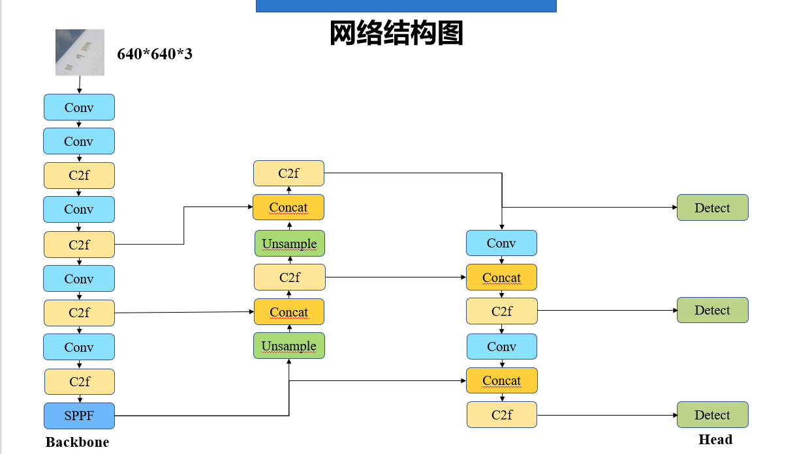
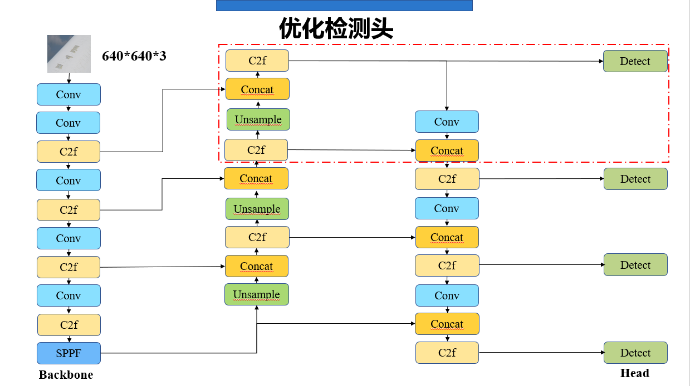

# YOLOv8检测头的改进

## 一、 YOLOv8检测头改进前后



---



---

## 一、 基础知识： 什么是上/下采样路径？

## 🔼 一、上采样路径（Upsample Path）——“从深到浅”的融合路线

### ✅ 起点：
最底部的 **SPPF（Spatial Pyramid Pooling Fast）模块**输出的特征图，具有：
- 最强的语义信息
- 最小的空间尺寸（比如 20×20）

---

### 🧭 上采样路径过程（从底往上走）：

1. **SPPF 输出特征图**
2. → `Upsample`（上采样，尺寸 ×2）
3. → `Concat`（与来自 Backbone 的中层特征拼接）
4. → `C2f`（残差卷积模块进行融合）
5. 重复上采样一次：
   - Upsample → Concat（与更浅层特征）→ C2f
6. ✅ **新增步骤（优化点）**：
   - 在最浅的一层输出后继续：
     - `C2f` → `Upsample` → `Concat`（与最浅层 Backbone 特征）→ `C2f`

---

### 📌 最终上采样路径输出：
- 输出 4 个特征图（从深到浅，尺寸依次增大）
- 分别用于后续 4 个检测分支（Detect）

---

### 🎯 上采样路径的核心作用：

| 功能 | 说明 |
|------|------|
| 特征融合 | 将深层语义与浅层空间细节融合 |
| 恢复空间分辨率 | 上采样用于还原图像细节，适配小目标检测 |
| 多尺度信息传递 | 每个阶段都融合不同深度的 Backbone 特征图 |
| 新增的上采样层 | 提升对超小目标的感知能力（如人脸、路牌） |

---

## 🔽 二、下采样路径（Downsampling Path）——“从浅到深”的整合路线

### ✅ 起点：
从**上采样路径输出的最浅层特征图**开始（比如 160×160）

---

### 🧭 下采样路径过程（从上往下走）：

1. 最顶层输出 → `Conv`（步长=2，下采样一倍）
2. → `Concat`（与上一层上采样输出拼接）
3. → `C2f`（卷积融合）
4. 再次 `Conv → Concat → C2f`，重复两次
5. 共得到 3 层下采样特征图

---

### 📌 最终下采样路径输出：
- 每一层作为不同尺度的输出，进入对应的 Detect 分支
- 总共和上采样输出一起构成 4 个尺度的 Detect

---

### 🎯 下采样路径的核心作用：

| 功能 | 说明 |
|------|------|
| 强化语义信息 | 将浅层细节特征下采样，与深层语义整合 |
| 提升感受野 | 每次下采样都扩大模型的感受区域 |
| 检测大目标 | 越往下越适合检测大型目标（如车辆、建筑） |
| 与上采样结构闭环 | 保证全尺度特征流通，信息不遗漏 |

---

## ✅ 总结一波：

| 路径 | 起点 | 核心操作 | 融合方式 | 检测目标 | 作用 |
|------|------|----------|-----------|-----------|------|
| 🔼 上采样路径 | SPPF 深层特征图 | Upsample → Concat → C2f | 融合浅层 Backbone 特征 | 小目标 / 细节 | 恢复空间，丰富细节 |
| 🔽 下采样路径 | 上采样路径最浅层输出 | Conv（步长2）→ Concat → C2f | 融合前一级高层语义 | 大目标 / 抽象语义 | 扩大感受野，整合全局语义 |

---

## 二、 为什么提升尺寸反而利于小目标和细节的观察？
直觉上我们可能会觉得：图越小、处理越快、是不是更适合检测小东西？  
但其实正好相反！让我们来一波通俗 + 结构 + 数学的 **三重解释**，保证你一下就理解。

---

## ✅ 通俗直觉版：  
> “小目标要想看清，就得放大。”

就像你在 Google 地图里看一个城市：
- 想看“整个城市轮廓” → 缩放小
- 想看“某栋楼上挂的招牌” → 得放大！

👉 小目标在原图上本来就占很小空间，如果你下采样，可能直接就消失了。

---

## ✅ 网络结构版解释：

### 🎯 卷积神经网络的空间分辨率 vs 表示力：

| 特征图层级 | 尺寸大小 | 表达语义 | 空间定位能力 | 适合目标类型 |
|------------|----------|-----------|----------------|----------------|
| 深层（下采样） | 小（20×20） | 强语义 | 弱空间信息 | 大目标、整体物体 |
| 浅层（上采样） | 大（160×160） | 弱语义 | 强定位能力 | 小目标、细节特征 |

---

### 举个例子：输入图像是 640×640，小目标占据 20×20 区域

- 如果你下采样到 20×20 的特征图，每个位置只能表示整张图的一个大区域！
- 也就是说：那个小目标可能就“落在某一个像素格子里”，甚至被平均掉了，无法检测

---

## ✅ 数学逻辑版（感受野 & 特征粒度）

### 什么是感受野（Receptive Field）？

> 指某个特征图上的一个像素点，在原始图像中对应的实际区域

下采样后每个点的感受野很大：
- 比如 20×20 特征图中一个点，对应原图是 32×32 区域
- 小目标可能只占 8×8，大概率在“一个格子中被模糊处理”

上采样后每个点的感受野更细：
- 160×160 特征图中一个点只对应原图的 4×4 区域
- 能更精准地定位小目标的边缘、形状、位置

---

## ✅ YOLO 设计也印证了这点：

| 输出层 | 特征图尺寸（假设输入 640） | 用于检测 |
|--------|-----------------------------|----------|
| P3     | 160×160                     | 小目标 ✅ |
| P4     | 80×80                       | 中目标 |
| P5     | 40×40                       | 大目标 |
| P6     | 20×20                       | 超大目标 ✅ |

> 所以网络**越往上采样（分辨率越大）→ 越适合检测小目标**

---

## ✅ 结论：

| 误解 | 正解 |
|------|------|
| “小目标 → 应该用小尺寸特征图” | ❌ |
| “小目标 → 应该放到大尺寸特征图上看清楚” | ✅ |

因此：

> **提升特征图的尺寸（上采样）是为了增强小目标的空间分辨率和定位精度**。这是小目标检测的关键策略之一。


---

- 我们可以看到左上方是输入，接着输入经过conv+conv+c2f+conv+c2f+conv+c2f+conv+c2f+SPPF后进入上采样路径Unsample+Concat+...+C2f输出大尺寸图，后续经下采样路径Conv+...+C2f输出小尺寸图。
- 改进应该是在上采样路径加入了C2f+Unsample+Concat+C2f，值得一提的是Concat连接到是backbone中较为浅层的输出。同时还在下采样路径顶端加入Conv+Concat以整合这个较大尺寸的特征图。
- 根据我的提示理清正确的方向，再次分析这一优化。

---

## 三、 优化方案讲解

## ✅ 正确认识：结构从左上开始是输入 → Backbone → Neck → Head

### 整体流程为：

```
输入图像
 ↓
Backbone（提取多尺度特征）
 ↓
SPPF
 ↓
Neck（融合：上采样路径 + 下采样路径）
 ↓
Head（Detect × N）
```


---

## 🧠 第一：结构主线分析（优化前后都一样）

Backbone 提取完多层特征后，送入 Neck：

- **从 SPPF（深层）开始向上走**：
  - `UpSample → Concat → C2f` ×3 次
  - 每次 Concat 对应的是来自 Backbone 的 **较浅层输出**
  - 输出最高分辨率的特征图（大图）

再往下走：
- **从大图开始向下走**：
  - `Conv（下采样） → Concat → C2f` ×3 次
  - 最终生成多尺度的特征图用于 Detect

✅ 所以：整个检测头就是：
- 上采样路径用于恢复空间结构（融合浅层特征）
- 下采样路径用于逐步整合更深语义（融合高层特征）

---

## 🔍 第二：优化前后具体区别（图像观察 + 箭头推导）

### 🔧 优化前结构（第二张图）：
- 上采样路径结束于最高分辨率
- 接着直接进入下采样路径进行三级 Detect 输出
- 没有特别加工最高分辨率输出

---

### 🔧 优化后结构（第一张图）新增内容：

### ✅ 【新增内容 1】：**上采样路径中增加了一段**

```
C2f → Upsample → Concat（和 Backbone 最浅层输出）→ C2f
```

作用：
- 将**融合后的高分辨率特征图**再进一步上采样一层（尺寸更大）
- 与 Backbone 最浅层输出融合（例如 160×160 尺寸）
- 生成更高分辨率的特征图（例如 160×160），用于 Detect！

📌 **这是新增的 Detect 输出：适配超小目标检测（例如交通标志、人脸）**

---

### ✅ 【新增内容 2】：下采样路径顶端加入了 Conv + Concat 处理

从这张大图（最高分辨率）往下送入下采样路径前，先进行一次：

```
Conv（缩小） → Concat（与前一级融合） → C2f
```

作用：
- 整合新加入的大图特征进入原有下采样路径
- 保证不同 Detect 分支之间信息连续

---

## 🔁 正确的上采样 & 下采样路径定义（以此图为准）

### 🔼 上采样路径（由 SPPF 向上走）

| 步骤 | 模块 | 说明 |
|------|------|------|
| 1 | SPPF 输出 | 深语义特征（尺寸最小） |
| 2 | Upsample → Concat（与较深 Backbone）→ C2f | 提升尺寸，融合语义 |
| 3 | 重复上采样两次 | 最终生成大尺寸特征图（如 80×80） |
| ✅ 新增 | C2f → Upsample → Concat（Backbone 浅层）→ C2f | 生成更大尺寸图（如 160×160）用于 Detect |

---

### 🔽 下采样路径（从大图向下走）

| 步骤 | 模块 | 说明 |
|------|------|------|
| 1 | Conv（步长2）→ Concat → C2f | 尺寸减半，整合高层语义 |
| 2 | 重复下采样两次 | 最终输出更小的特征图（如 20×20）用于 Detect |
| ✅ 顶端增加 | 对最大尺寸特征图先 `Conv + Concat` 处理再送入路径 | 与原路径保持一致性 |

---

## 🎯 优化总结

| 优化点 | 作用 | 好处 |
|--------|------|------|
| ✅ 上采样路径新增一层 | 生成更大特征图（如 160×160） | 🔥 提升小目标检测能力（行人、人脸、路标） |
| ✅ 与 Backbone 最浅层融合 | 保留更多图像细节 | 更丰富的纹理、边缘信息 |
| ✅ 新增 Conv + Concat 融合 | 让下采样路径兼容新特征 | 保持多尺度一致性 |
| ✅ 多一个 Detect 输出（总共4个） | 多尺度检测更细致 | 小中大+超大目标全覆盖 |

---

## 纯文字详细推理版本

---

### YOLOv8结构图中的上采样路径和下采样路径的结构和作用

**Backbone 下采样路径：**YOLOv8的骨干网络逐步对输入图像下采样以提取多尺度特征。从图左上角的输入图像（640×640×3）开始，依次经过多个卷积和C2f模块，分辨率逐级减半，特征通道数逐步增加，提取更抽象的特征：  

- **输入 & 初始卷积 (Conv)：**640×640×3的输入首先经过一个卷积层（如3×3卷积，步幅2），输出尺寸变为320×320，通道增加到一定数量（如64）。这个初始Conv模块用于提取基础特征并减小特征图尺寸，降低计算量的同时开始扩大神经网络感受野。  
- **逐级下采样 (Conv) 与特征提取 (C2f)：**随后，多层卷积块交替进行下采样和特征提取。例如，经过另一卷积层（步幅2）将尺寸从320×320降至160×160，通道数提升（如从64增至128），紧接着引入C2f模块对160×160特征图进行深入提取。C2f模块是一种Cross-Stage Partial的残差结构：它将特征一分为二，一部分直接跳连接，另一部分经过若干瓶颈卷积后再与跳接特征Concat融合 ([About the design principle of YOLOv8 network structure · Issue #13207 · ultralytics/ultralytics · GitHub](https://github.com/ultralytics/ultralytics/issues/13207#:~:text=The%20C2f%20module%2C%20as%20a,and%20accuracy%20of%20the%20model))。通过C2f，网络在每个尺度下提取更复杂的特征模式，增强表示能力。这样交替地，网络继续下采样：160×160特征再经Conv降为80×80（通道增至256），跟随C2f模块提炼80×80特征；80×80经Conv降为40×40（通道增至512），再通过C2f提炼40×40特征；40×40经Conv降为20×20（通道增至1024），再经C2f提炼20×20高级语义特征。每次Conv下采样都扩大感受野、获得更抽象语义信息，而紧随的C2f模块则在当前尺度下融合浅层和深层信息，防止信息丢失并丰富特征。  
- **SPPF模块：**在骨干末端，YOLOv8引入SPPF（Spatial Pyramid Pooling-Fast）模块对最终的20×20特征图进行处理。SPPF通过一系列池化操作扩大感受野：例如对20×20特征图进行不同尺度的最大池化，再将这些池化结果与原特征Concat在一起，最后经过一次卷积整合输出仍为20×20×1024的特征图 ([YOLOv8 Architecture Explained!. What is YOLOv8 ? | by Abin Timilsina | Medium](https://abintimilsina.medium.com/yolov8-architecture-explained-a5e90a560ce5#:~:text=Spatial%20Pyramid%20Pooling%20Fast%20,Block)) ([About the design principle of YOLOv8 network structure · Issue #13207 · ultralytics/ultralytics · GitHub](https://github.com/ultralytics/ultralytics/issues/13207#:~:text=of%20the%20model))。SPPF能够在不显著增加计算量的情况下捕获更大范围的上下文信息，增强模型对大尺度目标和全局语义的感知能力。这一步产生的特征图包含了最深层的语义信息，作为后续检测头的输入。  

**Head 上采样路径（特征融合）：**YOLOv8的检测头首先执行上采样路径（类似FPN特征金字塔的自底向上融合），将深层语义特征逐步融合到高分辨率特征图中，以丰富细节信息：  

- **由深到浅的上采样 (Upsample)：**从SPPF输出的20×20高语义特征开始，先通过上采样模块（如最近邻上采样×2）将特征图尺寸放大一倍至40×40，通道数保持不变 ([About the design principle of YOLOv8 network structure · Issue #13207 · ultralytics/ultralytics · GitHub](https://github.com/ultralytics/ultralytics/issues/13207#:~:text=The%20nn,number%20of%20channels%20is%20constant))。上采样使深层特征恢复更高的空间分辨率，便于与较浅层的细节特征结合。  
- **特征拼接融合 (Concat)：**将上采样得到的40×40特征图与骨干网络中对应的40×40特征图（来自下采样路径中P4层，例如通道512的特征）进行Concat拼接 ([About the design principle of YOLOv8 network structure · Issue #13207 · ultralytics/ultralytics · GitHub](https://github.com/ultralytics/ultralytics/issues/13207#:~:text=,cat%20backbone%20P4))。这个拼接融合了深层的语义信息和浅层的高分辨率细节，使得特征图同时具有较强语义和细粒度细节。  
- **C2f融合处理：**紧接着，对拼接后的40×40特征通过C2f模块进一步处理（融合后通道通常减回融合前的规模，例如输出通道512）。C2f模块在融合特征中引入残差连接和瓶颈卷积，进一步提炼融合后的特征，使得高分辨率特征充分结合来自深层的语义信息。经过此C2f，输出一个改进的40×40特征图。  
- **继续上采样到更高分辨率：**以上一步得到的融合特征为起点，再次经过Upsample上采样×2，将40×40特征放大到80×80（通道数不变）。然后将80×80的上采样特征与骨干中对应的80×80特征图（P3层，例如通道256的特征）Concat拼接融合。这样，高层次语义信息也被注入到了最高分辨率的特征图中，结合了原始浅层特征的精细空间细节。最后，通过一个C2f模块对拼接后的80×80特征进行处理和融合，输出优化的80×80特征图（例如通道输出为256）。这一系列**上采样+拼接+C2f**操作构成了上采样路径，将深层语义逐级传递到高分辨率特征图，丰富小目标检测所需的细节信息。  

**Head 下采样路径（特征降采样融合）：**在获得多尺度融合特征后，YOLOv8的检测头还执行自顶向下的降采样路径（类似PANet，从高分辨率向低分辨率信息回流），以加强各尺度特征的语义一致性和感受野，用于最终检测：  

- **高层特征下采样：**从上采样路径获得的最细粒度特征图（例如80×80，融合后通道256）出发，通过一个卷积层（步幅2）将其下采样到40×40，通道数提升或调整（例如变为256，保持与下一融合层一致）。这一Conv操作在检测头中再次压缩特征图尺寸，扩大神经元感受野，并为后续与中层特征融合做好通道匹配。  
- **特征融合 (Concat)：**将上述降采样得到的40×40特征与上采样路径中已经融合过一次的40×40特征（即前述Head上采样路径得到的40×40 C2f输出）进行Concat拼接 ([About the design principle of YOLOv8 network structure · Issue #13207 · ultralytics/ultralytics · GitHub](https://github.com/ultralytics/ultralytics/issues/13207#:~:text=,cat%20backbone%20P4))。这样，高分辨率的信息被回流融合到中等分辨率的特征图中，确保中尺度特征同时包含来自更细粒度层的细节。融合后通过C2f模块进一步处理40×40特征（输出通道例如512），增强特征的表达能力。  
- **进一步下采样融合低层：**接着，再次对40×40融合特征经过Conv下采样（步幅2）得到20×20特征图，通道调整为与最底层融合目标一致（例如512）。然后将其与骨干末端的20×20特征（SPPF输出的P5层特征，通道约1024）进行Concat拼接融合。通过这一融合，低分辨率的语义强特征中也注入了来自更高分辨率层的细节信息。随后利用C2f模块对该20×20拼接特征进行处理，输出优化的20×20特征图（例如通道1024）。经过这一系列**降采样Conv+拼接Concat+C2f**操作，各尺度特征图都融合了来自其他尺度的信息，语义和细节更加丰富。  
- **多尺度检测输出：**最终，检测头产生了三个尺度的输出特征图：80×80（小尺度目标，高分辨率细节）、40×40（中等目标，中等分辨率）、20×20（大目标，低分辨率高语义）——分别对应图中的P3、P4、P5层融合输出。YOLOv8在每个尺度的特征图上通过Detect模块预测边界框和类别（即多尺度目标检测），利用上采样路径提供的高分辨率语义信息来更好地识别小目标，利用降采样路径提供的广域感受野来定位大目标 ([About the design principle of YOLOv8 network structure · Issue #13207 · ultralytics/ultralytics · GitHub](https://github.com/ultralytics/ultralytics/issues/13207#:~:text=,features%20contribute%20to%20the%20final))。整个网络通过上下采样双路径融合，实现了各层特征的充分利用：上采样路径侧重融合高分辨率的语义信息，提高细粒度特征表达；下采样路径侧重增强特征的检测感受野和跨尺度一致性，最终提升检测效果。

---

明白了，我将为您对比分析YOLOv8原始检测头与优化后检测头的结构差异，重点解释优化设计的思路及其在检测包含大小目标（12类标签）任务中的意义，并结合可能带来的精度提升与推理速度变化进行说明。稍后我将给出详细解读。

# YOLOv8检测头结构优化对比分析

## 原始YOLOv8检测头结构特点
 ([image]()) YOLOv8的原始检测头采用了经典的多尺度特征融合结构，包括上采样(Upsample)、特征拼接(Concat)、C2f模块以及最终的Detect输出层等部分。如上图所示，来自骨干网络的不同尺度特征图（通常称为P3、P4、P5，对应小、中、大尺度特征）在检测头中逐级融合：首先将较低分辨率的深层特征上采样，与相邻尺度的特征图拼接融合，以结合高层语义和低层细节 ([YOLOv8 Architecture](https://www.linkedin.com/pulse/yolov8-architecture-kamal-sai-tillari-dngoc#:~:text=Upsample%20and%20Concatenate%3A))；然后通过C2f模块对拼接后的特征进行卷积处理，进一步提炼融合信息。YOLOv8中使用的C2f模块是一种改进的瓶颈结构，将输入特征一分为二，一部分直接跳连接，另一部分经过若干瓶颈层后再与跳接特征拼接，再经过卷积整合输出，从而在保持计算高效的同时丰富特征表达 ([YOLOv8 Architecture Explained!. What is YOLOv8 ? | by Abin Timilsina | Medium](https://abintimilsina.medium.com/yolov8-architecture-explained-a5e90a560ce5#:~:text=C2f%20block%20consists%20of%20a,into%20a%20final%20convolutional%20block))。这种自下而上的上采样融合完成后，YOLOv8的颈部还会进行自上而下的特征下采样融合（PAN结构），将细粒度特征传递回更深层：例如将融合后的高分辨率特征下采样，与中等分辨率的中间特征再次拼接，接着再下采样与最低分辨率特征融合 ([YOLOv8 Architecture](https://www.linkedin.com/pulse/yolov8-architecture-kamal-sai-tillari-dngoc#:~:text=Downsample%20and%20Concatenate%3A))。经过上述多尺度融合，最终得到兼具语义和细节的三个尺度特征图（如80×80用于小目标、40×40用于中等目标、20×20用于大目标 ([YOLOv8 Architecture](https://www.linkedin.com/pulse/yolov8-architecture-kamal-sai-tillari-dngoc#:~:text=))）。在Detect层，模型会针对每个尺度的特征图预测目标框和类别。YOLOv8采用无锚(anchor-free)检测策略，不再使用预设锚框，而是直接回归目标相对于网格中心的位置和尺寸 ([YOLOv8 Architecture Explained!. What is YOLOv8 ? | by Abin Timilsina | Medium](https://abintimilsina.medium.com/yolov8-architecture-explained-a5e90a560ce5#:~:text=Detect%20Block%20is%20responsible%20for,through%20candidate%20detections%20after%20inference))。Detect层通常为每个输出特征图设立两条子分支：一条用于边界框回归，另一条用于分类，每条子分支经过卷积层提取特征后输出最终的边框和类别预测 ([YOLOv8 Architecture Explained!. What is YOLOv8 ? | by Abin Timilsina | Medium](https://abintimilsina.medium.com/yolov8-architecture-explained-a5e90a560ce5#:~:text=The%20Detect%20Block%20contains%20two,loss%20and%20Class%20Loss%20respectively))。总的来说，原始YOLOv8检测头通过上采样+拼接融合多层特征，再经C2f等卷积模块处理，最后由Detect层在多尺度特征图上进行目标检测，实现了对不同尺寸目标（小、中、大）的检测支持。

## 优化后的检测头结构改进
 ([image]()) 优化后的YOLOv8检测头在原有基础上增加了如上图红色虚线框标出的额外分支。与原始结构相比，最大的变化是引入了一条“顶部”检测分支，即增加了一个更高分辨率的检测层（通常称为P2层，对应步长为4的特征图）。具体而言，优化结构对原始最细粒度的特征图（P3，步长8）再进行一次上采样，得到分辨率加倍的特征图；然后将其与来自骨干网络的浅层特征（步长4，对应P2层）进行特征拼接 ([Complex Scene Occluded Object Detection with Fusion of Mixed Local Channel Attention and Multi-Detection Layer Anchor-Free Optimization](https://www.mdpi.com/2673-4052/5/2/11#:~:text=to%20be%20added%20at%20the,is%20shown%20in%20Figure%206))。通过这种方式，将浅层的细节特征与深层的语义特征在更高分辨率下融合，形成了一个富含细节且具有一定语义上下文的新特征层。随后，在该融合特征上接入额外的卷积模块（如一个轻量的C2f或卷积层组）以进一步提炼融合后的信息，最后附加一个Detect输出模块用于产生这一尺度的目标检测结果。综上，优化后的检测头在原有的三尺度检测头之外新增加了一个更浅层的检测头（P2），包含了“上采样->拼接->卷积->Detect”的额外结构 ([Complex Scene Occluded Object Detection with Fusion of Mixed Local Channel Attention and Multi-Detection Layer Anchor-Free Optimization](https://www.mdpi.com/2673-4052/5/2/11#:~:text=In%20the%20backbone%20network%20of,features%20more%20prominent%2C%20one%20upsampling)) ([Complex Scene Occluded Object Detection with Fusion of Mixed Local Channel Attention and Multi-Detection Layer Anchor-Free Optimization](https://www.mdpi.com/2673-4052/5/2/11#:~:text=recognition,is%20shown%20in%20Figure%206))。这一新增分支引入了更多的特征融合：特别是融合了骨干浅层的细节特征与颈部深层特征，使得模型可以利用更丰富的层次信息。同时，由于增加的分支工作在更大的特征图上，每个检测单元看到的感受野相对原始P3层略有提升（因为融合了深层特征的上下文语义），并且捕获到了更加精细的局部细节信息，有助于**细节增强**和**多尺度特征表达**。总体而言，优化后的结构通过新增顶部检测分支，强化了高分辨率特征的利用，提供了更密集的特征图和额外的特征融合路径，从结构上为提升小目标检测性能奠定了基础。

## 对大小目标检测性能的影响
新增的检测头分支对小目标和大目标的检测性能都有所影响。其中，小目标检测能力的提升最为明显。首先，由于引入了P2层检测头，小目标在更高分辨率的特征图上进行预测，相当于在输入图像上占据了更多的像素，从而更容易被模型识别和定位。这解决了原本小目标在下采样过程中容易“淹没”于背景的问题，使模型对微小目标的定位更精确 ([A small object detection model in aerial images based on CPDD-YOLOv8 - PubMed](https://pubmed.ncbi.nlm.nih.gov/39755781/#:~:text=improved%20and%20added%20modules%20in,WiderPerson%2C%20VOC_MASK%20and%20SHWD%20datasets))。其次，新分支融合了浅层和深层特征，浅层提供了小目标的纹理细节，深层提供了上下文语义，两者结合使得小目标即使在复杂背景下也更容易与背景区分 ([YOLOv8 adds p2 detection layer and C2f. | Download Scientific Diagram](https://www.researchgate.net/figure/YOLOv8-adds-p2-detection-layer-and-C2f_fig1_381506783#:~:text=Context%201))。因此，优化后的检测头显著改善了小目标的检测召回率和定位准确度，增强了模型对小尺寸目标的敏感性。一些研究表明，增加P2小目标检测层后，模型对小目标的检测精度提升幅度可观，例如小目标AP提升超过13% ([A small object detection model in aerial images based on CPDD-YOLOv8 - PubMed](https://pubmed.ncbi.nlm.nih.gov/39755781/#:~:text=improved%20and%20added%20modules%20in,WiderPerson%2C%20VOC_MASK%20and%20SHWD%20datasets))（具体提升程度依赖于数据集和场景复杂度）。

对于大目标而言，优化后的结构在保持原有大目标检测能力的同时，也有潜在的收益。大尺寸目标主要由低分辨率的深层特征图(P5)检测，其语义信息丰富，本身易于检测。虽然新增加的P2分支主要针对小目标，但多尺度特征的重新分配与融合有助于**大目标语义表达能力**的完善。一方面，增加的小目标分支使各尺度检测头的分工更加明确，模型可以更有针对性地处理不同大小的目标，减少了不同尺度目标特征混杂造成的干扰 ([](https://drpress.org/ojs/index.php/fcis/article/download/28514/27999/40996#:~:text=model%20is%20proposed%20in%20this,the%20expression%20of%20small%20object))。大目标的特征主要集中在高层次特征图上，不会因小目标而误导，同时整个网络的多尺度表示更加丰富，有助于模型更全面地理解大目标的轮廓和语义。另一方面，如果优化结构在特征融合过程中将细粒度特征适度传递回高层（通过PAN路径），大目标的检测分支也能获益于部分细节信息，从而在边界回归和类别判别上更加精细。例如，大目标往往包含小的细节区域，额外的细节特征融合可能帮助模型更好地区分相似的大目标类别。总体来看，优化后的检测头通过引入额外的尺度，不仅**提高了模型的尺度感知能力**，使其对不同大小目标都有更合适的特征表示，还在一定程度上提升了大目标的描述完整性和分类准确度。不过，相较于小目标，大目标检测性能的提升可能没有那么显著，更多体现为模型对尺度变化的适应性增强和误检漏检率的轻微改善。

## 模型精度和推理速度的影响
在引入上述结构优化后，模型的整体精度（特别是mAP指标）有望提升。新增的小尺度检测头显著提高了对微小目标的检测能力，从而拉动整体mAP上升。例如，有研究在YOLOv8基础上增加P2检测层并结合其他改进后，模型的mAP@0.5提升了约6.9个百分点 ([A small object detection model in aerial images based on CPDD-YOLOv8 - PubMed](https://pubmed.ncbi.nlm.nih.gov/39755781/#:~:text=improved%20and%20added%20modules%20in,WiderPerson%2C%20VOC_MASK%20and%20SHWD%20datasets))。即便不考虑其他模块，仅增加额外检测头也能有效改善小目标相关的检测指标，从而提高模型在包含大小目标场景下的平均精度。尤其是在小目标占比较高的数据集中，这种优化带来的mAP提升会更加明显。此外，多尺度特征融合的增强也使模型对各种尺度目标更加稳定，可能减少因为尺度不匹配导致的漏检，提高检测的可靠性。需要指出的是，精度的提升幅度取决于具体数据集和优化细节，但总体趋势是**准确率有所提高，特别是小目标AP显著提升** ([A small object detection model in aerial images based on CPDD-YOLOv8 - PubMed](https://pubmed.ncbi.nlm.nih.gov/39755781/#:~:text=improved%20and%20added%20modules%20in,WiderPerson%2C%20VOC_MASK%20and%20SHWD%20datasets))。

在推理速度和资源开销方面，增加检测头分支势必会带来一定的代价。首先，模型参数量有所增加，因为多了一套卷积模块和输出层用于P2分支（尽管为了控制开销，新增分支通常设计得比较轻量）。其次，计算量明显上升：新增加的高分辨率特征图尺寸是原始最细特征的四倍面积（例如从80×80扩展到160×160），在其上进行卷积和预测会增加额外的FLOPs。这意味着推理时每张图像需要更多计算，可能导致FPS下降。文献中报告的结果显示，增加P2分支的小模型参数量仍在可控范围，例如YOLOv8n从约3.2M增至4.4M参数，计算量从8.9 GFLOPs增至19.3 GFLOPs ([](https://drpress.org/ojs/index.php/fcis/article/download/28514/27999/40996#:~:text=The%20results%20show%20that%20the,of%20parameters%20and%20calculation%20cost))。虽然计算成本增加了一倍多，但换来了显著的准确率提升，这被认为是可以接受的权衡 ([](https://drpress.org/ojs/index.php/fcis/article/download/28514/27999/40996#:~:text=The%20results%20show%20that%20the,of%20parameters%20and%20calculation%20cost))。在实际应用中，优化后的模型推理速度相较原始可能略有降低，例如帧率下降几个百分点，具体取决于硬件性能和模型规模。如果是实时要求很高的场景，需要根据精度提升和速度下降的幅度来权衡取舍。总体而言，这种检测头结构的优化以适度增加模型复杂度为代价，带来了对小目标检测性能的大幅改进和整体精度的提升 ([](https://drpress.org/ojs/index.php/fcis/article/download/28514/27999/40996#:~:text=with%20other%20models%2C%20the%20parameters,of%20parameters%20and%20calculation%20cost))。在模型设计优化中，这种方法提供了参考依据：通过引入额外尺度的特征融合与检测，可以在可接受的计算开销内有效提升多尺度检测能力，从而在同时包含大目标和小目标的任务中取得更好的检测表现。