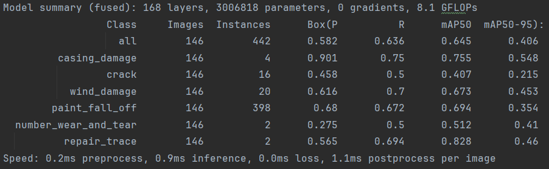
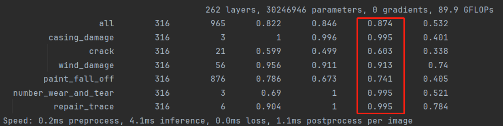

# 有关训练和测试效果的数据说明

## 一、 优化前后测试数据图

---

`mAP@0.5`（mean Average Precision at IoU=0.5）是目标检测中常用的评估指标，用来衡量模型在检测任务上的整体性能。下面我给你分点解释一下：

---

### 📌 1. 什么是 AP（Average Precision）

- **Precision（精确率）**：预测为正的样本中，有多少是真的正样本。
- **Recall（召回率）**：所有真实正样本中，有多少被模型正确预测出来。
- 将检测结果按置信度从高到低排序，画出 Precision-Recall 曲线。
- **AP 就是这条 PR 曲线下的面积**，衡量的是该类的检测质量。

---

### 📌 2. 什么是 IoU（Intersection over Union）

- 用来衡量预测框和真实框之间的重叠程度。
- 计算公式：  
  \[
  IoU = \frac{\text{预测框 ∩ 真实框}}{\text{预测框 ∪ 真实框}}
  \]
- IoU 的值介于 0 和 1 之间，值越大表示预测越准。

---

### 📌 3. `mAP@0.5` 是什么意思？

- `mAP` 是 **mean Average Precision**，即对所有类别的 AP 求平均。
- `@0.5` 表示计算 AP 时，IoU 阈值设置为 **0.5**，也就是说：
  - 如果 IoU ≥ 0.5 就认为检测正确（True Positive）
  - 否则就是错误检测（False Positive）

---

### ✅ 举个例子：

如果一个目标检测模型有 3 类（人、狗、猫），分别在 IoU=0.5 时的 AP 是：

- 人：0.85  
- 狗：0.78  
- 猫：0.80  

那 `mAP@0.5` 就是：
\[
mAP@0.5 = \frac{0.85 + 0.78 + 0.80}{3} = 0.81
\]

---

### 🔄 延伸：`mAP@0.5:0.95` 是什么？

- COCO 比赛更严格，使用多个 IoU 阈值（从 0.5 到 0.95，每隔 0.05）来平均：
  \[
  mAP@[0.5:0.95] = \frac{AP_{0.5} + AP_{0.55} + ... + AP_{0.95}}{10}
  \]
- 这个评价更全面，更难拿高分。

---

`mAP@0.5:0.95`（或写作 `mAP_0.5:0.95`）是 **目标检测任务中最严格、最权威的评估指标之一**，特别是在 COCO 数据集上。它衡量的是模型在不同 IoU 阈值下的平均检测性能。

---

### ✅ 一句话解释：

> **mAP@0.5:0.95 是在 IoU 从 0.5 到 0.95（步长为 0.05）的 10 个阈值下计算 AP，然后取平均值。**

---

### 📌 更具体地说，它怎么来的？

- 在以下 10 个 IoU 阈值下分别计算 AP：
  \[
  0.50, 0.55, 0.60, ..., 0.95
  \]
- 对每个 IoU 阈值：
  - 计算每一类的 AP（Average Precision）
  - 然后对所有类求平均（得到 mAP）
- 最后对这 10 个 IoU 下的 mAP 再求平均。

所以它的完整计算公式可以写为：

\[
\text{mAP}_{0.5:0.95} = \frac{1}{10} \sum_{t=0.5}^{0.95} \text{mAP@IoU=t}
\]

---

### 🔍 和 `mAP@0.5` 的区别是什么？

| 指标名          | 描述                                 | 难度 |
|------------------|------------------------------------------|------|
| `mAP@0.5`         | 只考虑 IoU ≥ 0.5 时是否检测正确             | ⭐    |
| `mAP@0.5:0.95`    | 同时考虑多个 IoU（从 0.5 到 0.95）          | ⭐⭐⭐⭐⭐|

---

### 🚀 为什么 `mAP@0.5:0.95` 更有价值？

- 不只是判断框有没有 "碰到" 真值（IoU ≥ 0.5）
- 它还衡量预测框和真实框之间对齐得**有多精确**
- 更全面反映检测质量
- COCO 官方排行榜和大部分论文都用这个指标

---

### 📊 一个实际例子：

假设你模型的 AP 表现如下（3 类）：

| 类别 | AP@0.5 | AP@0.75 | AP@0.95 | 平均（mAP@0.5:0.95） |
|------|--------|---------|---------|------------------------|
| 人   | 0.85   | 0.60    | 0.20    | 0.55                   |
| 狗   | 0.80   | 0.50    | 0.10    | 0.47                   |
| 猫   | 0.78   | 0.55    | 0.15    | 0.49                   |

最终 `mAP@0.5:0.95 ≈ 0.50`，远低于 `mAP@0.5 = 0.81`，说明模型预测框位置还不够精准。

---

### ⚠️ 小结：

- `mAP@0.5`：宽松，仅检测出目标即可。
- `mAP@0.5:0.95`：严格，要检测准，还要框得好。
- 如果你在跑检测模型（如 YOLOv5、YOLOv8、Detectron2），`mAP@0.5:0.95` 是**最关键的性能指标之一**。
