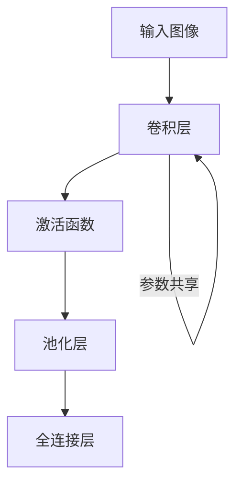
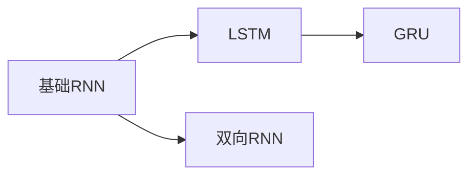
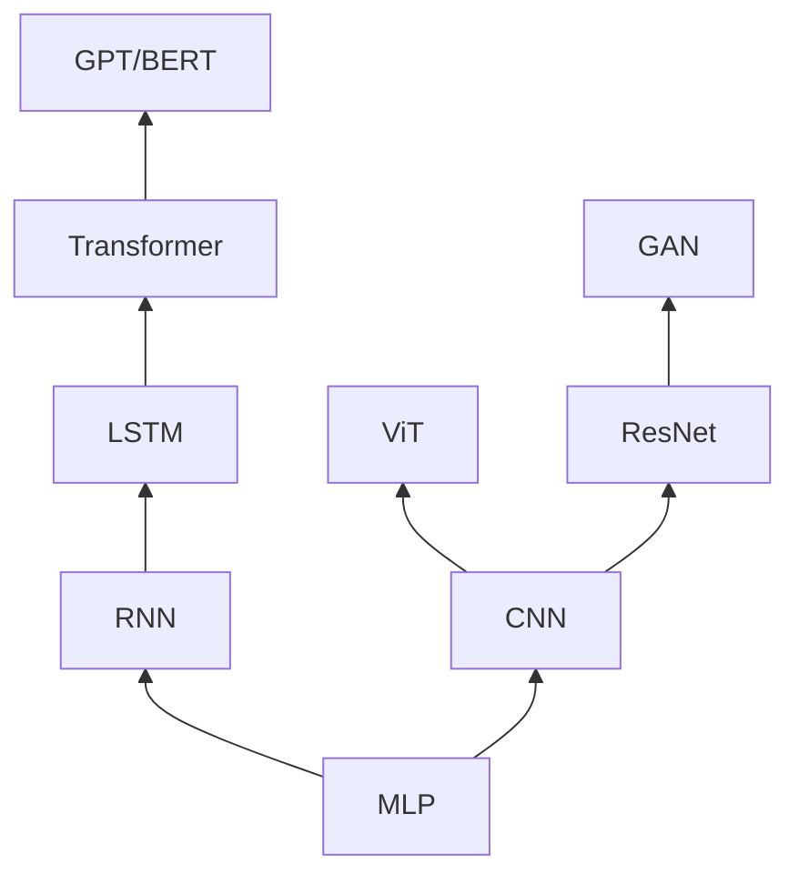
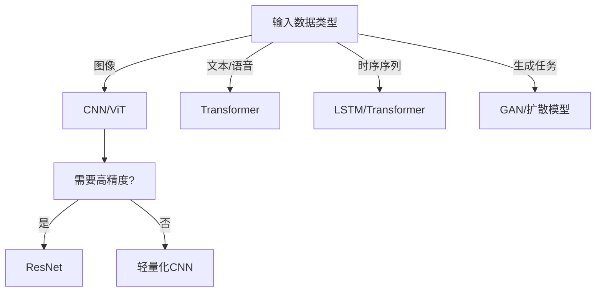

# 深度神经网络（DNN）基础

深度神经网络（DNN）是人工神经网络的一种，其中包含了多个隐藏层（即网络的“深度”）。这些网络通过层与层之间的连接来模拟人脑的神经元工作方式。DNN用于从数据中学习模式，并且能够进行分类、回归等任务。

## 一、 神经网络基本结构

- **输入层**：接受原始输入数据（例如图像的像素值），将其传递到下一层。

- **隐藏层**：由多个神经元组成，通过加权和激活函数计算输入数据的处理结果。深度神经网络通常有多个隐藏层，这些层能够提取输入数据的各种复杂特征。

- **输出层**：根据任务需求，输出预测结果，例如分类标签或回归值。

### 1. 神经元

在神经网络中，隐藏层的神经元（或称为神经单元）是神经网络的核心组件之一。每个隐藏层的神经元通过连接到前一层的所有神经元和后续层的所有神经元来执行计算任务。

#### 1.1 神经元的基本构成

一个神经元（或神经单元）接收来自前一层神经元的输入，进行加权求和，并通过一个激活函数来生成输出。其基本结构可以分为以下几个部分：

- **输入（Input）**：每个神经元接收来自上一层神经元的输入。这些输入是上一层神经元的输出，或者是数据的特征（在输入层的神经元中）。
  
- **权重（Weight）**：每个输入都有一个与之相对应的权重值。权重表示输入对该神经元的影响程度。神经网络通过调整这些权重来学习数据的模式。

- **偏置（Bias）**：偏置是神经元的额外参数，它用于调整神经元的输出，以便更好地拟合数据。偏置的作用是平移激活函数，使得神经元可以有更多的自由度。

- **加权求和（Weighted Sum）**：神经元将接收到的所有输入乘以相应的权重后相加，并加上偏置项，形成一个加权和：
  \[
  z = \sum_{i=1}^{n} x_i w_i + b
  \]
  其中，\(x_i\) 是输入，\(w_i\) 是对应的权重，\(b\) 是偏置项，\(n\) 是输入的数量。

- **激活函数（Activation Function）**：加权和会通过一个激活函数进行处理，以引入非线性。激活函数的作用是决定神经元的输出值。常见的激活函数有：
  - **Sigmoid**：输出值范围在0到1之间。
  - **ReLU（Rectified Linear Unit）**：当输入大于0时输出输入本身，其他情况下输出0。
  - **Tanh**：输出值范围在-1到1之间。
  - **SiLU（Swish）**：具有更平滑性质的激活函数，通常表现得比ReLU更稳定。

  神经元的最终输出 \(a\) 是激活函数作用后的结果：
  \[
  a = f(z)
  \]
  其中，\(f(z)\) 是激活函数。

#### 1.2 神经元在隐藏层的作用

隐藏层神经元的作用是对输入数据进行抽象和转换。每一层的神经元会通过加权求和和激活函数生成新的特征，这些特征在下一层神经元中进一步处理。

- **特征抽象**：隐藏层神经元帮助网络从数据中提取越来越复杂的特征。输入层通常只处理原始数据（例如图像的像素值），而隐藏层神经元则逐步提取数据的高级特征。例如，在图像识别任务中，第一层可能会学习边缘特征，而后面的层则会学习更复杂的形状或物体部分。

- **非线性变换**：激活函数引入非线性，使得神经网络能够学习复杂的映射关系。如果没有非线性激活函数，神经网络的所有层实际上就是线性变换，这样网络的能力非常有限。

#### 1.3 隐藏层神经元与模型表现的关系

隐藏层神经元的数量和层数决定了神经网络的表达能力。

- **层数（深度）**：深层网络（即有更多隐藏层的网络）可以学习更复杂的特征，因此通常具有更强的表达能力，能够处理更复杂的任务。但是，增加层数也会增加计算复杂度，并且可能会导致梯度消失或梯度爆炸问题，需要采取适当的技术来缓解这些问题（例如使用批归一化、残差连接等）。
  
- **神经元数量**：每个隐藏层中的神经元数量决定了该层能表示的特征的数量。更多的神经元可以学习更多的特征，但也可能导致计算和存储的开销增加。过多的神经元可能会导致过拟合，而太少的神经元则可能不足以学习数据中的复杂模式。

#### 1.4 总结

- 每个隐藏层的神经元通过加权求和和激活函数进行计算，提取输入数据中的特征。
- 激活函数引入了非线性，使得神经网络能够学习复杂的映射。
- 隐藏层神经元的数量和层数直接影响到网络的表现和计算效率。

## 二、 深度神经网络训练的解释

---

### 1. 神经网络是什么？

想象神经网络是一个由“神经元”组成的多层网络，每一层负责处理数据并传递给下一层。例如：
- **输入层**：接收原始数据（比如一张图片的像素）。
- **隐藏层**（可能有多层）：逐步提取特征（比如边缘→形状→物体）。
- **输出层**：给出预测结果（比如判断图片是“猫”还是“狗”）。

每一层神经元的输出由两个步骤决定：
1. **线性变换**：输入数据 × 权重（Weight） + 偏置（Bias）。
2. **非线性激活函数**：比如 ReLU、Sigmoid，让网络能学习复杂模式。

---

### 2. 训练神经网络的目的是什么？
- **目标**：让网络能根据输入数据做出正确的预测。
- **方法**：调整网络中的“权重”和“偏置”参数，使得预测结果尽可能接近真实答案。

---

### 3. 训练的核心思想：试错 + 优化

#### (1) 前向传播（Forward Propagation）
- **过程**：数据从输入层 → 隐藏层 → 输出层，逐层计算，最终得到预测结果。
- **示例**：输入一张猫的图片，经过网络计算后输出“猫的概率80%，狗的概率20%”。

#### (2) 计算损失（Loss）
- **损失函数（Loss Function）**：衡量预测结果与真实结果的差距。
  - 例如：如果真实答案是“猫”，损失函数会惩罚“狗的概率20%”。
  - 常用损失函数：均方误差（回归任务）、交叉熵（分类任务）。

#### (3) 反向传播（Backpropagation）
- **核心问题**：如何知道每个参数（权重/偏置）对损失的影响？
- **方法**：从输出层反向逐层计算每个参数的**梯度**（即损失函数对参数的偏导数）。
  - **梯度**告诉我们应该如何调整参数才能减少损失。

#### (4) 参数更新
- **优化器（Optimizer）**：根据梯度调整参数。
  - 最常用的是**梯度下降（Gradient Descent）**：`参数 = 参数 - 学习率 × 梯度`。
  - 学习率（Learning Rate）：控制参数更新的步长（太大容易震荡，太小收敛慢）。

---

### 4. 为什么需要“深度”神经网络？
- **浅层网络**：只能学习简单的模式（比如线性关系）。
- **深层网络**：通过多层非线性变换，可以学习复杂的特征（比如从像素→边缘→物体部件→整个物体）。
- **代价**：层数越多，训练越难（梯度消失/爆炸、计算量大等）。

---

### 5. 训练中的关键挑战

#### (1) 梯度消失（Vanishing Gradient）
- **问题**：反向传播时，梯度随着层数增加指数级减小，导致浅层参数几乎不更新。
- **原因**：激活函数（如 Sigmoid）的导数过小，或权重初始化不当。
- **解决方法**：用 ReLU 激活函数、残差连接（ResNet）、批量归一化（BatchNorm）。

#### (2) 梯度爆炸（Exploding Gradient）
- **问题**：梯度指数级增大，导致参数更新幅度过大，模型无法收敛。
- **原因**：权重初始值过大，或网络层数太多。
- **解决方法**：梯度裁剪（Gradient Clipping）、权重正则化。

#### (3) 过拟合（Overfitting）
- **问题**：模型在训练集上表现很好，但在测试集上很差（背答案而不是学习规律）。
- **解决方法**：数据增强、Dropout（随机关闭部分神经元）、正则化（限制参数大小）。

---

### 6. 训练流程的类比
想象你在教一个机器人调整收音机频道：
1. **前向传播**：机器人尝试拧动旋钮（参数），得到一个声音（预测结果）。
2. **计算损失**：你告诉机器人当前声音有多接近目标频道（损失函数）。
3. **反向传播**：机器人分析每个旋钮对声音的影响（梯度）。
4. **参数更新**：机器人根据分析结果调整旋钮（优化器更新参数）。
5. **重复**：直到找到最佳频道（模型收敛）。

---

### 7. 总结：训练的核心步骤
1. **输入数据** → 前向传播 → 得到预测。
2. 计算预测与真实的差距（损失函数）。
3. 反向传播计算每个参数的梯度。
4. 用优化器更新参数，缩小损失。
5. 重复以上步骤，直到模型表现足够好。

---

### 8. 学习建议
1. **实践**：用框架（如 PyTorch/TensorFlow）写一个简单的神经网络，训练 MNIST 手写数字识别。
2. **可视化**：观察训练过程中损失如何下降，参数如何变化。
3. **深入理解**：从数学角度推导反向传播（链式法则）。


## 三、 深度神经网络（DNN）模型家族详解

### 1. 基础模型：多层感知机（MLP）
#### 1.1  核心结构
- **组成**：输入层 + 多个全连接隐藏层 + 输出层  
- **激活函数**：Sigmoid、ReLU、Tanh  
- **数学表达**：  
  \[
  y = f(W_n \cdot f(W_{n-1} \cdot ... f(W_1 x + b_1) ... ) + b_n)
  \]

#### 1.2 特点与局限
- ✅ **优点**：理论万能逼近能力（Universal Approximation Theorem）  
- ❌ **缺点**：参数爆炸（全连接导致参数量为 \(O(n^2)\)）  
- **应用场景**：结构化数据（如金融风控评分）  

---

### 2. 计算机视觉核心：卷积神经网络（CNN）
#### 2.1 关键突破模型
| 模型       | 提出时间 | 核心创新                     | 应用场景         |
|------------|----------|------------------------------|------------------|
| LeNet-5    | 1998     | 首个实用CNN（手写数字识别）  | MNIST分类        |
| AlexNet    | 2012     | ReLU+Dropout，GPU训练        | ImageNet分类     |
| ResNet     | 2015     | 残差连接（解决梯度消失）     | 超深层图像模型   |
| Vision Transformer (ViT) | 2020 | 纯注意力机制处理图像         | 大规模图像分类   |

#### 2.2 CNN核心组件


#### 2.3 与MLP的联系
- **改进点**：  
  - 全连接层 → 局部卷积（减少参数）  
  - 手动特征工程 → 自动特征提取  

---

### 3. 序列建模：循环神经网络（RNN）家族
#### 3.1 模型演进路径


#### 3.2 核心对比
| 模型  | 门控机制           | 参数量 | 典型应用           |
|-------|--------------------|--------|--------------------|
| RNN   | 无                 | 低     | 简单时间序列预测   |
| LSTM  | 输入门/遗忘门/输出门 | 高     | 机器翻译（2014年前）|
| GRU   | 更新门/重置门      | 中     | 语音识别           |

#### 3.3 局限性
- **梯度消失**：长序列中早期信息丢失  
- **计算效率**：无法并行处理序列（时序依赖）  

---

### 4. 注意力机制革命：Transformer
#### 4.1 核心架构
```python
# Transformer编码器层（PyTorch伪代码）
class EncoderLayer(nn.Module):
    def __init__(self):
        self.attention = MultiHeadAttention()
        self.ffn = PositionwiseFFN()
        
    def forward(x):
        x = x + self.attention(x)  # 残差连接
        x = x + self.ffn(x)
        return x
```

#### 4.2 关键技术突破
- **自注意力（Self-Attention）**：  
  \[
  \text{Attention}(Q, K, V) = \text{softmax}\left(\frac{QK^T}{\sqrt{d_k}}\right)V
  \]
- **位置编码**：将序列位置信息注入模型  
- **多头机制**：并行学习多种注意力模式  

#### 4.3 与RNN的联系
- **取代RNN**：通过全局注意力机制消除时序依赖，支持并行计算  
- **继承思想**：保留序列建模能力，但实现方式革命性变化  

---

### 5. 生成模型：AE与GAN
#### 5.1 自编码器（Autoencoder）
- **结构**：  
  ```mermaid
  graph LR
  A[输入] --> B[编码器] --> C[潜在空间] --> D[解码器] --> E[重建输出]
  ```
- **变体**：  
  - VAE（变分自编码器）：引入概率分布  
  - Denoising AE：抗噪声鲁棒性  

#### 5.2 生成对抗网络（GAN）
- **对抗训练**：  
  \[
  \min_G \max_D V(D, G) = \mathbb{E}_{x \sim p_{data}}[\log D(x)] + \mathbb{E}_{z \sim p_z}[\log (1 - D(G(z)))]
  \]
- **代表作**：StyleGAN（高质量人脸生成）、CycleGAN（图像风格迁移）  

#### 5.3 与CNN的联系
- **底层特征共享**：GAN的生成器和判别器常使用CNN结构提取图像特征  

---

### 6. 模型家族演进图谱


---

### 7. 关键联系总结
1. **基础架构共享**：  
   - 所有模型均基于MLP的全连接计算单元扩展  
   - 激活函数（ReLU）和优化方法（Adam）跨模型通用  

2. **技术继承与革新**：  
   - CNN的局部感知 → Transformer的局部注意力（ViT）  
   - RNN的序列建模 → Transformer的全局注意力  

3. **融合趋势**：  
   - 神经符号系统：DNN+规则推理（如知识图谱嵌入）  
   - 多模态模型：CNN+Transformer（如CLIP）  

---

### 8. 选型决策树


## 三、 卷积神经网络（CNN）

卷积神经网络（**CNN**，Convolutional Neural Network）是深度学习中最常用的神经网络之一，特别是在图像处理领域（如图像分类、目标检测、语义分割等）。CNN在图像、视频分析、语音识别等任务中展现了出色的性能，其主要优势是能够自动地从数据中学习特征，而无需手动特征工程。

### 1. CNN的基本构成

CNN的结构通常由以下几个主要组成部分构成：

- **输入层**：输入层接受原始数据（通常是图像）。图像数据通常以像素值的形式输入，RGB图像会有三个通道（Red, Green, Blue），灰度图像只有一个通道。
- **卷积层（Convolutional Layer）**：卷积层是CNN的核心，通过卷积操作提取图像中的局部特征。
- **池化层（Pooling Layer）**：池化层用于缩小图像的空间尺寸，减少计算量并提取图像中的重要特征。
- **全连接层（Fully Connected Layer）**：全连接层通过将特征映射展平，进行特征综合并做出最终的预测（例如分类）。
- **输出层**：输出层负责给出最终的预测结果，例如图像属于哪个类别。

### 2. 卷积层（Convolutional Layer）

卷积层是CNN中最重要的部分，其主要作用是提取图像中的局部特征。卷积操作是一种与传统的全连接层不同的特殊操作，它通过多个卷积核（滤波器）对输入图像进行滑动卷积操作，提取不同的特征。

#### 2.1 卷积操作

卷积操作涉及卷积核（或滤波器）的使用，它是一个较小的矩阵（如3x3、5x5等），在输入图像上滑动并与图像的每一部分进行点乘运算，从而生成特征图（Feature Map）。每个卷积核会产生一个特定的特征图，这些特征图代表了图像中不同类型的局部特征，如边缘、角点、纹理等。

- **计算过程**：卷积核与图像的局部区域（如3x3的子区域）做点乘操作并求和，得到一个值，这个值就是输出特征图的一个像素值。然后，卷积核继续在图像上滑动，直到扫描完整个图像。
- **多个卷积核**：在卷积层中，会使用多个卷积核，每个卷积核负责提取不同的特征，因此输出的特征图通常有多个通道。

#### 2.2 步长（Stride）和填充（Padding）

- **步长（Stride）**：卷积核在输入图像上滑动的步长决定了输出特征图的大小。步长越大，特征图的尺寸越小。常见的步长为1和2。
- **填充（Padding）**：为了保持输入图像的尺寸或者避免卷积操作导致特征图尺寸缩小，常常使用填充。常见的填充方式有“**same padding**”和“**valid padding**”：
  - **Same Padding**：填充输入图像，使得输出的特征图尺寸与输入图像相同。
  - **Valid Padding**：不进行填充，输出特征图的尺寸小于输入图像。

### 3. 池化层（Pooling Layer）

池化层用于减少特征图的尺寸（即降低空间分辨率），从而减少计算量并提高模型的鲁棒性。池化操作有助于捕捉图像中的重要信息，同时抑制噪声。

#### 3.1 最大池化（Max Pooling）

最大池化是最常用的池化操作。在最大池化中，每个池化区域（如2x2或3x3）会选取该区域内的最大值作为输出。例如，假设池化区域是2x2，则该区域的四个像素中，最大池化会选择其中的最大值。

#### 3.2 平均池化（Average Pooling）

与最大池化类似，平均池化选择池化区域中的平均值作为输出。平均池化通常用于对特征图进行平滑处理。

### 4. 全连接层（Fully Connected Layer）

全连接层（FC层）是神经网络中最常见的层之一，尤其在传统的神经网络和一些深度学习架构（如卷积神经网络CNN的最后几层）中非常重要。它通常位于网络的末端，主要用于将提取到的特征进行组合，输出最终的预测结果。全连接层将输入的特征通过线性变换映射到一个输出空间，结合激活函数来实现非线性变换，从而实现模型的分类、回归等任务。

#### 4.1 展平（Flatten）

由于前面的卷积和池化层输出的是多维特征图，经过展平（flatten）操作后，将其转换为一维向量，再输入到全连接层进行处理。

#### 4.2 分类与回归

- **分类**：如果任务是分类（如图像分类），最后一层通常是一个Softmax层，输出各个类别的概率。
- **回归**：对于回归任务（如预测房价），通常使用一个线性激活函数，输出一个连续的值。

#### 4.3 工作原理

- 全连接层的主要功能是将前一层的输出（通常是特征图或特征向量）与本层的所有神经元连接，每个神经元接收来自前一层所有节点的输入并进行加权求和，随后通过激活函数来产生输出。

**计算过程**：

- 假设输入向量是 \( x = [x_1, x_2, ..., x_n] \)，全连接层有 \( m \) 个神经元。每个神经元 \( j \) 都有一个权重向量 \( w_j = [w_{j1}, w_{j2}, ..., w_{jn}] \)，以及一个偏置项 \( b_j \)。计算过程如下：

- **加权和**：每个神经元的输入通过加权求和得到一个中间值（线性变换）：
  \[
  z_j = \sum_{i=1}^{n} w_{ji} \cdot x_i + b_j
  \]
  其中，\( w_{ji} \) 是权重，\( x_i \) 是前一层的输入，\( b_j \) 是偏置项。

- **激活函数**：为了引入非线性，通常会使用激活函数 \( f(z_j) \) 对加权和 \( z_j \) 进行变换，输出结果：
  \[
  a_j = f(z_j)
  \]
  激活函数 \( f \) 可以是 **ReLU**、**Sigmoid**、**Tanh** 或 **Softmax**（用于多类分类问题）等。

#### 4.4 输出向量

如果全连接层有 \( m \) 个神经元，那么全连接层的输出向量是：
\[
a = [a_1, a_2, ..., a_m]
\]
其中，\( a_1, a_2, ..., a_m \) 是经过激活函数变换后的输出。

### 5. 激活函数（Activation Function）

激活函数是卷积神经网络中的关键组件，通常用于引入非线性，使得网络能够学习复杂的模式。常见的激活函数包括：
- **ReLU（Rectified Linear Unit）**：最常用的激活函数之一，能够加速训练并解决梯度消失问题。
- **Sigmoid**：常用于二分类问题。
- **Tanh**：常用于传统神经网络。
- **Softmax**：通常用于多分类问题，输出每个类别的概率。

### 6. 卷积神经网络的训练

CNN通过反向传播算法来训练。网络的损失函数通常使用交叉熵损失函数（对于分类任务）或均方误差损失函数（对于回归任务）。优化算法，如梯度下降（或其变种，如Adam），用于通过更新权重来最小化损失函数。

### 7. CNN的优势

- **局部连接**：卷积层的神经元仅与输入图像的局部区域连接，而不是与整个图像的每个像素都连接，这样可以减少参数的数量。
- **权重共享**：卷积核在整个图像中滑动并共享相同的权重，这减少了参数数量并提高了计算效率。
- **平移不变性**：通过卷积操作，CNN能够识别图像中的物体，无论它们出现在图像的哪个位置。

### 8. 应用领域

CNN已被广泛应用于多个领域，尤其是图像处理相关的任务，如：
- **图像分类**：如识别图像中是什么物体。
- **目标检测**：如识别图像中多个物体的位置和类别。
- **语义分割**：将图像划分为多个区域，标记每个区域所属的类别。
- **风格迁移**：将图像的风格应用到其他图像上。
- **医学图像分析**：如自动诊断疾病。

### 总结

卷积神经网络（CNN）通过卷积操作提取图像中的局部特征，利用池化操作减少特征图的尺寸，并通过全连接层进行最终的分类或回归任务。CNN的优势在于能够自动从数据中学习特征，并且能够有效处理图像、视频等高维数据，广泛应用于计算机视觉和图像分析等领域。

好的，既然你想更详细地理解 Transformer 的原理，我们就从**构建动机 → 整体结构 → Attention 机制 → 每层细节 → 理论推导**的角度，做一个深入讲解，帮助你掌握 Transformer 的底层逻辑与设计哲学。

---

## 四、 Transformer 原理深入解析

---

### 一、背景与动机：为什么抛弃 RNN？

传统的序列建模（比如机器翻译）主要依赖 RNN / LSTM，它们有几个明显缺点：

| 问题 | 原因 |
|------|------|
| 不能并行 | RNN 是按时间步“串行”处理 |
| 长距离依赖难建模 | 依赖梯度穿过多个时刻，容易衰减 |
| 信息瓶颈 | 编码端通常只能生成一个“固定向量” |

于是，Transformer 提出：
> 🌟 **Attention is all you need**：不用循环、用注意力全搞定！

---

### 二、整体结构：Encoder-Decoder 架构

#### Transformer 是一个典型的**Encoder-Decoder**结构

- **Encoder** 负责读取输入序列 → 编码为一系列向量（语义表示）
- **Decoder** 利用这个表示 + 已生成的词 → 逐步生成输出序列

#### 图示：

```
输入序列 → [Encoder Block] x N → 编码结果 → [Decoder Block] x N → 输出序列
```

每个 Encoder / Decoder block 都有若干标准子层。

---

### 三、核心组件详解

#### 1️⃣ 多头自注意力机制（Multi-Head Self-Attention）

##### 🔍 Self-Attention 目标：

> 对于输入序列中的每个词，让它**自动关注序列中其他词**的信息。

举例：
- 对于句子 "The animal didn't cross the street because it was too tired."
- "it" 应该关注 "animal"，不是 "street"
- Attention 能学到这种依赖

---

#### 🔧 Attention 计算流程：

对每个输入向量 \( x_i \)，我们先通过三个投影矩阵生成：

- Query 向量 \( Q = x_i W^Q \)
- Key 向量 \( K = x_i W^K \)
- Value 向量 \( V = x_i W^V \)

接下来计算注意力权重：

\[
\text{Attention}(Q_i, K_j, V_j) = \text{softmax}\left(\frac{Q_i \cdot K_j^T}{\sqrt{d_k}}\right)V_j
\]

含义：
- 每个词都生成 Q/K/V，表示“我想查什么（Q）”，“你是什么（K）”，“我要你给我什么（V）”
- 相似度高（Q 和 K 点乘大），V 的值就被加权得更多

---

#### 🧠 Multi-Head Attention：

> 用多个头（不同 W 矩阵）学习不同注意力视角，让模型更强！

假设有 8 个头，每个头维度为 \( d_k = 64 \)，总维度为 512。

将多个头的输出拼接 + 再线性变换回来。

---

#### 2️⃣ 残差连接 + LayerNorm

对每个子层都加：

\[
\text{Output} = \text{LayerNorm}(x + \text{SubLayer}(x))
\]

防止梯度消失，保持信息流通（残差）+ 收敛稳定（LayerNorm）

---

#### 3️⃣ 前馈网络 FFN（逐位置）

每个词位的向量都过一个独立的两层网络：

\[
\text{FFN}(x) = \text{ReLU}(xW_1 + b_1)W_2 + b_2
\]

这个非线性映射增加模型表达能力。

---

#### 4️⃣ 位置编码（Positional Encoding）

因为 Transformer 结构不包含“位置信息”，所以需要显式告诉模型词的位置。

最常用的是**正余弦编码**（论文原始方案）：

\[
\text{PE}_{(pos,2i)} = \sin\left(\frac{pos}{10000^{2i/d_{model}}}\right) \\
\text{PE}_{(pos,2i+1)} = \cos\left(\frac{pos}{10000^{2i/d_{model}}}\right)
\]

也有变种如可学习的位置向量、相对位置编码等。

---

### 四、Decoder 的 Masked Attention

在训练 Decoder 时，为了防止看到“未来的信息”，需要对注意力进行 mask。

- 自注意力中，只允许当前位置关注**当前位置及以前的位置**
- 防止信息泄露

---

### 五、Transformer 的并行与优势

- 不依赖序列顺序 → 可以并行处理所有词
- 全局建模能力强 → 每个词都可以直接看到所有上下文
- 模块堆叠自然 → 堆叠越深，捕捉的依赖越复杂

---

### 六、计算复杂度与局限

| 项目              | 复杂度                       |
|-------------------|------------------------------|
| 自注意力层         | \( O(n^2 \cdot d) \)         |
| FFN 层             | \( O(n \cdot d^2) \)         |
| 总体               | \( O(n^2) \) 时空都较高     |

> ❗ 所以长序列（如文档/音频）会面临“注意力矩阵爆炸”问题

为此出现了：
- Longformer、Performer、BigBird 等改进版本
- 用稀疏 attention 或分块机制降低复杂度

---

### 七、训练方式（以语言模型为例）

- 输入一段文本 → 拆成词 → Embedding + PE
- 输入到多个 Encoder/Decoder 层
- 输出是概率分布（预测下一个词）

训练目标：

\[
\mathcal{L} = - \sum_{t=1}^T \log P(x_t | x_1, ..., x_{t-1})
\]

（类似语言模型的 cross entropy）

---

### 八、再来一波总结图（组件）：

```
         Input Embedding + Pos Encoding
                     ↓
        ┌────────────────────────────┐
        │       Encoder Block × N    │
        │ ┌────────────────────────┐ │
        │ │  Multi-Head Attention  │ │
        │ │  Add & Norm            │ │
        │ │  FFN                   │ │
        │ │  Add & Norm            │ │
        │ └────────────────────────┘ │
        └────────────────────────────┘
                     ↓
          编码后的上下文向量（输入给 Decoder）
```

Decoder 部分多加一个 masked self-attention 和 cross-attention。


