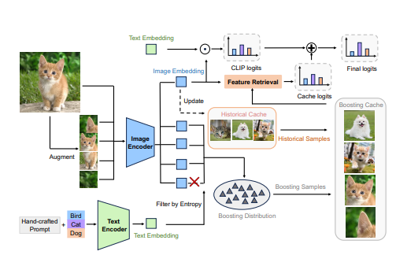

---

## 一、图像增强模块（左上）
- **模块**：get_ood_preprocess(args)，get_cross_dataset_preprocess(preprocess, args)

- **作用**：OOD数据集/跨数据集的图像增强器，返回一个可以call的类对原图像进行增强，返回原图+增强图的列表，增强配置来源于args

- **两个增强模块的区别**：base_transform有区别，get_ood_preprocess(args)进行放缩裁剪，get_cross_dataset_preprocess(preprocess, args)不进行放缩裁剪

---

## 二、获取类文本向量矩阵（左下）

- **模块**：clip_classifier(...)

- **作用**：根据类名称和人工提示构造类文本向量矩阵，用于后续与图像特征矩阵做积

---

## 三、